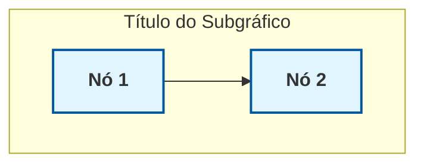

# AGENTS.md - Guia para Agentes de IA - Sistema de Gestão de Propriedade Intelectual UPE

## Visão Geral

Este repositório contém um **Sistema Integral de Gestão de Propriedade Intelectual** para a Universidade de Pernambuco (UPE), desenvolvido com metodologia de Engenharia de Contexto. O sistema abrange desde a pré-qualificação de invenções até o depósito no INPI, com foco em qualidade técnica, UX (User Experience) e eliminação de retrabalho.

**Objetivo Central:** Transformar o NIT/UPE em referência nacional em patentes de alta qualidade.

### Estrutura Atual do Repositório

O repositório está em fase de desenvolvimento e contém:
- **Documentação mestra**: Planejamento, arquitetura, instruções
- **Especificações técnicas**: SPEC_*.md (formato de dicionário de dados)
- **Formulários completos**: HTML e Markdown prontos para uso
- **Diagramas**: Mermaid (UML e fluxos visuais)
- **PDFs originais**: Documentos de referência extraídos
- **extracted_text/**: Texto extraído dos PDFs para análise

### Metodologia de Trabalho
1. Extraia texto dos PDFs usando `pdftotext`
2. Crie especificações seguindo o formato SPEC_*.md
3. Gere formulários HTML/Markdown seguindo os templates
4. Documente diagramas em Mermaid para visualização
5. Valide contra gotchas e limites definidos em AGENTS.md

---

## Comandos Essenciais

### Desenvolvimento Local

```bash
# Iniciar servidor local (Python)
cd docs && python -m http.server 8000
# Acesse: http://localhost:8000

# Iniciar servidor local (Node.js - recomendado)
npx serve docs
# Acesse: http://localhost:3000

# Abrir diretamente no navegador (testes básicos)
open docs/index.html  # macOS
xdg-open docs/index.html  # Linux
```

### Testes Automatizados

```bash
# Executar todos os testes via console do navegador
# 1. Abra docs/index.html no navegador
# 2. Abra o console (F12)
# 3. Execute: runAllTests()

# Exportar relatório de testes
exportTestReport()

# Verificar se todos os formulários existem
cd docs
test -f formularios/formulario_pi_mu.html && echo "✓ Formulário PI/MU encontrado"
test -f formularios/formulario_cii.html && echo "✓ Formulário CII encontrado"
test -f formularios/formulario_rpc.html && echo "✓ Formulário RPC encontrado"
test -f anexos/anexo_a.html && echo "✓ Anexo A encontrado"
test -f anexos/anexo_b.html && echo "✓ Anexo B encontrado"
test -f anexos/anexo_c.html && echo "✓ Anexo C encontrado"
test -f anexos/anexo_f.html && echo "✓ Anexo F encontrado"
```

### Diagramas PlantUML

```bash
# Renderizar diagramas PlantUML (requer Java)
java -jar plantuml.jar arquivo.puml

# Renderizar todos os diagramas de uma vez
for puml in *.puml; do
    java -jar plantuml.jar "$puml"
done

# Instalar PlantUML (se não tiver)
# Baixar em: https://plantuml.com/download
# ou usar via Docker: docker run -v $(pwd):/data plantuml/plantuml arquivo.puml
```

### GitHub e Deploy

```bash
# Inicializar repositório (se necessário)
git init
git branch -M main

# Adicionar remote
git remote add origin https://github.com/USERNAME/REPO.git

# Commit e push
git add .
git commit -m "feat: description"
git push -u origin main

# Verificar status do workflow no GitHub
# Acesse: https://github.com/USERNAME/REPO/actions
```

### Análise e Processamento de Documentos

```bash
# Listar PDFs disponíveis
ls -la archives/*.pdf

# Converter PDFs para texto (para análise)
pdftotext arquivo.pdf extracted_text/arquivo_extraido.txt

# Extrair texto de todos os PDFs
for pdf in archives/*.pdf; do pdftotext "$pdf" "extracted_text/${pdf%.pdf}.txt"; done

# Verificar estrutura de diretórios
tree -L 3  # ou ls -R

# Buscar conteúdo em documentos
grep -r "termo" extracted_text/
grep -i "reivindicação" extracted_text/
```

### Processamento de PDFs

```bash
# Converter um PDF específico para texto
pdftotext arquivo.pdf extracted_text/arquivo_extraido.txt

# Converter todos os PDFs de uma vez
for pdf in *.pdf; do pdftotext "$pdf" "extracted_text/${pdf%.pdf}.txt"; done

# Verificar o que foi extraído
ls -la extracted_text/
head -50 extracted_text/arquivo_extraido.txt  # Visualizar início do arquivo

# Buscar termos específicos em arquivos extraídos
grep -i "patente\|invenção" extracted_text/*.txt
grep -i "anexo\|formulario" extracted_text/*.txt

# Contar linhas para verificar integridade
wc -l extracted_text/*.txt
```

### Validação e Qualidade

```bash
# Contar caracteres em arquivos
wc -m arquivo.txt  # caracteres
wc -w arquivo.txt  # palavras

# Verificar consistência de terminologia
grep -r "Patente de Invenção\|PI" .
grep -r "Modelo de Utilidade\|MU" .
grep -r "Computer Implemented Invention\|CII" .

# Validar limites de caracteres
awk 'length <= 1000' arquivo.txt
```

### Organização de Arquivos

```bash
# Criar estrutura de diretórios
mkdir -p {1.FASE_PREPARACAO,2.FASE_SUBMISSAO,3.FASE_ANALISE,4.FASE_DEPOSITO,5.FASE_ROBUSTEZ_CONFORMIDADE}

# Mover arquivos organizadamente
mv anexo*.txt 1.FASE_PREPARACAO/Anexos_Padrao/
mv template*.txt 1.FASE_PREPARACAO/Templates_Redacao/

# Criar índice de documentos
find . -type f -name "*.md" | sort > indice_documentos.txt
```

---

## Organização do Repositório

### Estrutura Principal

```
NIT-UPE_Sistema_Gestao_PI/
├── 0. DOCUMENTACAO_MESTRA/           # Documentação fundamental
│   ├── AGENTS.md                     # ESTE ARQUIVO
│   ├── PLANEJAMENTO_SISTEMA_GESTAO_PI.md  # Planejamento completo
│   └── INSTRUCOES_ENGENHARIA_PROMPT.md    # Guia de criação de prompts
│
├── 1. FASE_PREPARACAO/               # Responsabilidade: Pesquisador
│   ├── 1.1 Educacao_Previa/          # Guias educativos básicos
│   ├── 1.2 Anexos_Padrao/           # Anexos A, B, C, F (Golden Kit)
│   ├── 1.3 Templates_Redacao/        # Templates técnicos
│   ├── 1.4 Guias_Referencia/        # Exemplos "Certo/Errado"
│   └── 1.5 Guias_Especificos/       # Guias por tipo de patente
│
├── 2. FASE_SUBMISSAO/                # Portão de Entrada (Filtro)
│   ├── 2.1 Formularios_Validados/    # Formulários com validação
│   ├── 2.2 Checklists_Validacao/     # Checklists de conferência
│   └── 2.3 Comunicacao_Automatica/   # E-mails automáticos
│
├── 3. FASE_ANALISE/                  # Responsabilidade: NIT/Comissão
│   ├── 3.1 Templates_Avaliador/      # Pareceres semaforizados
│   ├── 3.2 Ferramentas_Avaliacao/    # Ferramentas de análise
│   ├── 3.3 Devolucoes/               # Minutas de devolução
│   └── 3.4 KPIs_Monitoramento/       # Dashboard de indicadores
│
├── 4. FASE_DEPOSITO/                 # Responsabilidade: NIT + Pesquisador
│   ├── 4.1 Finalizacao_Documental/   # Ajustes finais
│   ├── 4.2 Comunicacao_Oficial/      # Memorandos e cartas
│   └── 4.3 Acompanhamento/           # Acompanhamento INPI
│
├── 5. FASE_ROBUSTEZ_CONFORMIDADE/    # Responsabilidade: Qualidade
│   ├── 5.1 Blinding_Contra_Indeferimento/  # Proteção contra rejeição
│   ├── 5.2 Anexos_Adicionais/       # Termos legais
│   └── 5.3 Protecao_Multipla/        # PI + DI + RPC
│
├── 6. PORTAL_WEB/                   # Responsabilidade: Comunicação
│   ├── 6.1 HTML_Componentes/         # Componentes web
│   ├── 6.2 Briefings_Design/         # Briefings para designers
│   └── 6.3 Conteudo_Site/            # Conteúdo do portal
│
└── 7. IMPLANTACAO/                   # Responsabilidade: Gestão
    ├── 7.1 Roadmap_Execucao.md
    ├── 7.2 Cronograma_Semanal.md
    ├── 7.3 Plano_Treinamento.md
    └── 7.4 Checklist_Implementacao.md
```

---

## Formato de Especificações (SPEC_*.md)

### Estrutura Padrão de Documentos SPEC

Todos os arquivos de especificação devem seguir este formato:

```markdown
# ESPECIFICAÇÃO DO [NOME DO DOCUMENTO/FORMULÁRIO]

**Versão do Documento:** X.X  
**Data de Validação:** DD/MM/AAAA  
**Responsável:** Engenharia de Contexto - Crush  
**Ator:** [Persona: Inventor, Avaliador, Sistema]

---

## 1. OBJETIVO
[Descrição clara do objetivo em 1-2 parágrafos]

---

## 2. DICIONÁRIO DE DADOS (DATA DICTIONARY)

### 2.1. [Nome da Categoria]

| ID Campo | Nome do Campo | Descrição | Tipo de Input | Validação / Regras | Obrigatório? | Fonte |
|----------|----------------|-----------|---------------|---------------------|---------------|-------|
| XX_01 | Nome Campo | Descrição detalhada | Text/Select/Date/etc | Regras de validação | SIM/NÃO | Documentação/Fonte |

---

## 3. REFERÊNCIAS EXTERNAS

> **Justificativa:** Explicar por que estas referências são necessárias

**Fonte [X]:** Nome da Fonte  
*Link:* URL  
*Conteúdo Validado:* Descrição do que foi validado

---

## 4. REGRAS DE NEGÓCIO

1. [Regra de negócio 1]
2. [Regra de negócio 2]
3. [Regra de negócio 3]

---

## 5. FLUXO DE PREENCHIMENTO

[Descrever a ordem lógica de preenchimento]

---

## 6. VALIDAÇÃO AUTOMÁTICA

[Listar validações que o sistema deve executar]

---

## 7. VERSÃO E HISTÓRICO
| Versão | Data | Autor | Mudanças |
|--------|------|-------|----------|
| 1.0 | DD/MM/AAAA | Nome | Criação inicial |
```

### Convenções para ID de Campos

- **Prefixos por tipo de documento:**
  - `AA_XX` para Anexo A (Busca de Anterioridade)
  - `AB_XX` para Anexo B (Matriz Problema x Solução)
  - `AC_XX` para Anexo C (Memorial Descritivo)
  - `AF_XX` para Anexo F (Qualificação de Inventores)
  - `F1_XX` para Formulário de Patente Padrão (PI/MU)
  - `FC_XX` para Formulário CII (Software)
  - `FR_XX` para Formulário RPC (Registro de Programa)

- **Numeração:** Sequencial (01, 02, 03...)

---

## Convenções de Código e Documentação

### Convenções para Diagramas Mermaid

Este projeto usa **Mermaid v11.6** para diagramas. Arquivos relevantes:
- `DIAGRAMAS_UML_MERMAID.md` - Diagramas UML estritos (Use Case, Class, Sequence, State, Activity)
- `DIAGRAMAS_VISUAIS_MERMAID.md` - Fluxos visuais (Flowcharts, arquitetura)
- `ARQUITETURA_AUTOMACAO.md` - Diagramas de arquitetura de integração

**Convenções de Estilo:**


### Convenções para Formulários HTML

Arquivo principal: `FORMULARIOS_COMPLETOS.md`

**Estrutura Padrão HTML:**
```html
<!DOCTYPE html>
<html lang="pt-BR">
<head>
    <meta charset="UTF-8">
    <title>Título do Formulário</title>
    <style>
        /* Cores UPE: Azul (#2196F3, #1976D2) */
        /* Estrutura: header -> form-container -> sections */
        /* Cada seção tem: section-title + campos */
        /* Contadores de caracteres: .char-count */
        /* Botões: submit-btn */
    </style>
</head>
<body>
    <div class="form-container">
        <div class="header">Título</div>
        <form>
            <div class="section">
                <div class="section-title">Seção</div>
                <!-- Campos aqui -->
            </div>
        </form>
    </div>
</body>
</html>
```

### Convenções de Nomenclatura

**Arquivos:**
- Use **MÁIUSCULAS** para documentos principais (ex: `TEMPLATE_RESUMO.md`)
- Use **minúsculas** para arquivos de suporte (ex: `glossario.md`)
- Use **snake_case** para nomes compostos (ex: `modelo_utilidade_guia.md`)
- Prefixo `ANO_` para documentos de referência anual (ex: `2024_RELATORIO.md`)

**Seções em Markdown:**
```markdown
# TÍTULO PRINCIPAL (MÁIUSCULAS)
## Subtítulo (Maiúsculas apenas primeira palavra)
### Sub-subtítulo (Maiúsculas apenas primeira palavra)

#### Convenção de Elementos

**Elementos OBRIGATÓRIOS:** Use ✅ para marcar
**Elementos PROIBIDOS:** Use ❌ para marcar
**Pontos de Atenção:** Use ⚠️ para alertas
**Gotchas:** Use 🚨 para armadilhas comuns
```

**Semaforização (RAG - Red/Amber/Green):**
```markdown
🟢 VERDE: Aprovado, pronto para avançar
🟡 AMARELO: Com ressalvas, pequenos ajustes necessários
🔴 VERMELHO: Inviável ou crítico, requer revisão completa
```

### Convenções de Limites de Caracteres

**CRÍTICO:** Respeitar estritamente os limites de caracteres definidos:

| Campo | Mínimo | Máximo | Recomendado |
|-------|--------|--------|-------------|
| Título | - | 150 caracteres | 100-120 |
| Problema/Dor | 100 | 1.000 caracteres | 400-600 |
| Solução Técnica | 500 | 4.000 caracteres | 1.500-2.500 |
| Estado da Técnica | 200 | 2.000 caracteres | 800-1.200 |
| Vantagens | 100 | 1.500 caracteres | 400-800 |
| Palavras-chave | 50 | 100 caracteres | 70-90 |
| Resumo | 50 palavras | 200 palavras | 100-150 palavras |
| Relatório Descritivo | 500 | 15.000 palavras | 3.000-8.000 |
| Reivindicações | 1 | 10 | 3-6 |

**Comando de Validação:**
```bash
# Verificar tamanho em caracteres
wc -m arquivo.txt

# Verificar tamanho em palavras
wc -w arquivo.txt

# Validar se está dentro do limite (ex: máximo 1000 caracteres)
if [ $(wc -m < arquivo.txt) -gt 1000 ]; then echo "EXCEDEU LIMITE"; fi
```

### Convenções de Terminologia

**SEMPRE usar terminologia padronizada:**

| Termo Correto | Termo Incorreto | Quando Usar |
|---------------|-----------------|-------------|
| **PI (Patente de Invenção)** | "patente genérica" | Proteção de lógica técnica (20 anos) |
| **MU (Modelo de Utilidade)** | "patente de objeto" | Proteção de forma física (15 anos) |
| **RPC (Registro de Programa de Computador)** | "patente de software" | Proteção de código (50 anos) |
| **CII (Computer Implemented Invention)** | "patente de software" | Software com efeito técnico |
| **NIT (Núcleo de Inovação Tecnológica)** | "setor de patentes" | Unidade oficial de PI |
| **NAI (Novidade, Atividade Inventiva, Aplicação Industrial)** | "critérios básicos" | Critérios de patenteabilidade |
| **Estado da Técnica** | "anterioridade genérica" | Tudo divulgado antes |
| **Suficiência Descritiva** | "descrição detalhada" | Capacidade de reprodução (Art. 24 LPI) |
| **SisGen** | "biodiversidade" | Sistema de controle de recursos genéticos |
| **TRL (Technology Readiness Level)** | "maturidade" | Nível de maturidade tecnológica (1-9) |

---

## Abordagem de Testes

### Validação de Documentos

**Antes de considerar qualquer documento completo, passe por Sanity Check:**

```markdown
# SANITY CHECK - [Nome do Documento]

## 1. Validação de Forma
- [ ] Título claro e descritivo
- [ ] Seções organizadas logicamente
- [ ] Linguagem acessível para público não técnico
- [ ] Formatação consistente
- [ ] Gramática e ortografia verificadas

## 2. Validação de Conteúdo
- [ ] Todas as informações técnicas corretas
- [ ] Exemplos práticos incluídos
- [ ] Referências cruzadas funcionais
- [ ] Alertas de "Gotchas" presentes
- [ ] KPIs alinhados

## 3. Validação de Usabilidade
- [ ] Instruções executáveis (actionable)
- [ ] Checklist de validação presente
- [ ] Pré-requisitos claros
- [ ] Público-alvo definido
- [ ] Casos de uso documentados

## 4. Validação Técnica
- [ ] Terminologia padronizada (glossário)
- [ ] Limites de caracteres respeitados
- [ ] Requisitos legais (LPI) cumpridos
- [ ] Exemplos "Certo/Errado" contrastantes
- [ ] Gotchas identificados

## 5. Validação de Integridade
- [ ] Completo (sem seções pendentes)
- [ ] Consistente (sem contradições)
- [ ] Referenciado (links funcionais)
- [ ] Versionado (histórico de mudanças)
- [ ] Validado (revisão por especialista)
```

**Comando de Validação Automática:**
```bash
# Verificar completude (todas as seções presentes)
grep -E "^##|^###" documento.md | wc -l

# Verificar consistência de terminologia
grep -oE "PI|Patente de Invenção|MU|Modelo de Utilidade|CII|Computer Implemented Invention" documento.md | sort | uniq -c

# Verificar limites de caracteres em campos específicos
# (ajustar conforme o campo a ser validado)
wc -m < campo_problema.txt
```

### Teste de Usabilidade

**Simular cenário de uso:**
1. Ler documento como se fosse um inventor sem conhecimento prévio
2. Tentar seguir as instruções passo a passo
3. Identificar pontos de confusão ou ambiguidade
4. Adicionar esclarecimentos se necessário

**Perguntas de Validação:**
- ❓ "Um inventor sem conhecimento de PI consegue entender?"
- ❓ "As instruções são executáveis?"
- ❓ "Os exemplos são claros e aplicáveis?"
- ❓ "O que pode dar errado? Gotchas documentados?"
- ❓ "Este documento suporta os KPIs definidos?"

---

## Gotchas Importantes e Padrões Não-Óbvios

### 🚨 Gotchas Críticos por Tipo de Patente

**Biotecnologia/Processos Físicos:**
- ❌ NUNCA use temperatura ambiente → Use "20°C a 25°C"
- ❌ NUNCA use "otimizado" → Use faixas numéricas ("45°C a 50°C")
- ❌ NUNCA use números fixos → Use faixas ("120 a 180 minutos")
- ❌ NUNCA use adjetivos qualitativos → "ótimo", "eficiente" são proibidos
- ✅ SEMPRE use taxonomia exata (Gênero/Espécie)
- ✅ SEMPRE verifique SisGen se usar biodiversidade brasileira
- ✅ SEMPRE use proporcionalidade estequiométrica ("1:10 (m/v)")

**Software CII (Computer Implemented Invention):**
- ❌ NUNCA use prints de tela de interface → Use fluxogramas em blocos
- ❌ NUNCA coloque código-fonte no relatório descritivo → Use descrição agnóstica
- ❌ NUNCA proteja regras de negócio abstratas → Proteja efeito técnico
- ❌ NUNCA use "user-friendly" como vantagem → Use métricas técnicas
- ✅ SEMPRE use reivindicação tripla: MÉTODO + SISTEMA + MÍDIA
- ✅ SEMPRE refira-se a hardware (processador, memória, armazenamento)
- ✅ SEMPRE defina efeito técnico (performance, memória, segurança)

**Produtos Físicos (Dispositivos/Máquinas):**
- ❌ NUNCA use fotografias → Use desenhos técnicos em P&B
- ❌ NUNCA use cores → Use P&B com hachuras
- ❌ NUNCA use dimensões fixas → Use faixas dimensionais
- ❌ NUNCA proteja design ornamental → Isso é Desenho Industrial (DI)
- ✅ SEMPRE inclua todas as vistas necessárias (frente, lateral, superior, perspectiva)
- ✅ SEMPRE use cortes/seções se necessário
- ✅ SEMPRE use referências numéricas consistentes (1, 2, 3...)

### 🚨 Gotchas de Processo

**Prazo de Anterioridade (Crítico):**
- ⚠️ O inventor tem **12 meses** após qualquer divulgação para depositar
- ⚠️ Após 12 meses, a invenção entra em domínio público
- ⚠️ Incluída na LPI Art. 31

**Suficiência Descritiva (Art. 24 LPI):**
- ⚠️ O relatório descritivo deve permitir reprodução por "técnico no assunto"
- ⚠️ Se não for suficientemente detalhado → Indeferimento
- ⚠️ Não deve deixar margem para interpretação

**Reivindicações Independentes vs Dependentes:**
- ⚠️ Reivindicação 1 deve ser **INDEPENDENTE** (não referenciar nenhuma outra)
- ⚠️ Reivindicações 2+ podem ser **DEPENDENTES** (refere-se à anterior)
- ⚠️ Não faça reivindicação dependente de dependente (caos referencial)

**Estado da Técnica vs. Invenção:**
- ⚠️ Estado da Técnica = O que já existe (o "antes")
- ⚠️ Invenção = A inovação proposta (o "depois")
- ⚠️ **Sempre compare:** "Diferentemente do Estado da Técnica..."
- ⚠️ Sempre destaque a lacuna que sua invenção preenche

### 🚨 Gotchas de Validação

**Checklist de Conferência Final (Obrigatório):**
```markdown
# CHECKLIST FINAL ANTES DO ENVIO

## Documentação Obrigatória
- [ ] Anexo A (Busca de Anterioridade)
- [ ] Anexo B (Matriz Problema x Solução)
- [ ] Anexo C (Memorial Descritivo)
- [ ] Anexo F (Qualificação de Inventores)
- [ ] Termo de Cessão (se aplicável)

## Validação Técnica
- [ ] Resumo: 50-200 palavras
- [ ] Reivindicações: 3-6 (máximo 10)
- [ ] Desenhos/Figuras: Referências numéricas consistentes
- [ ] Relatório Descritivo: Suficiência descritiva

## Validação Legal
- [ ] SisGen preenchido (se usar biodiversidade)
- [ ] TRL definido (níveis 1-9)
- [ ] Prazo de 12 meses não extrapolado

## Assinaturas
- [ ] Todos os inventores assinaram
- [ ] Assinaturas digitalizadas (PDF)
- [ ] Termo de cessão assinado
```

### 🚨 Gotchas de Comunicação

**Técnica "Sanduíche" para Devoluções:**
1. **Pão Superior:** Agradecimento e reconhecimento do esforço
2. **Recheio:** Problemas identificados + Plano de Ação Corretivo
3. **Pão Inferior:** Apoio e expectativa de próxima submissão

**Semaforização de Pareceres:**
- 🟢 **Verde:** "Aprovado sem ressalvas" → Prosseguir para depósito
- 🟡 **Amarelo:** "Aprovado com ressalvas" → Ajustes menores necessários
- 🔴 **Vermelho:** "Inviável/Desfavorável" → Reformulação completa ou rejeição

## Padrões de Projeto Específicos

### Template Padrão de Documento

```markdown
# [NOME_DO_DOCUMENTO]

## 1. Objetivo
[Descrição clara do propósito deste documento em 1-2 frases]

## 2. Público-Alvo
[Quem deve usar este documento: Pesquisador, Avaliador, Advogado, etc.]

## 3. Pré-requisitos
[O que precisa estar completo antes de usar este documento]

## 4. Conteúdo Principal
[Corpo do documento detalhado]

### 4.1 Seção 1
[Conteúdo da seção]

### 4.2 Seção 2
[Conteúdo da seção]

## 5. Limites e Restrições
[O que NÃO deve ser feito neste contexto]

## 6. Exemplos Práticos

### 6.1 Exemplo "Certo" ✅
[Exemplo correto a seguir]

### 6.2 Exemplo "Errado" ❌
[Exemplo incorreto a evitar]

## 7. Pontos de Atenção (Gotchas)
[Detalhes não óbvios que podem causar problemas]

## 8. Checklist de Validação
- [ ] Item 1
- [ ] Item 2
- [ ] Item 3

## 9. Referências Cruzadas
- [Documentos relacionados] → links absolutos

## 10. Versão e Histórico
| Versão | Data | Autor | Mudanças |
|--------|------|-------|----------|
| 1.0 | DD/MM/AAAA | Nome | Criação inicial |
```

### Estrutura de Anexos (Golden Kit)

**Anexo A - Busca de Anterioridade:**
```markdown
# ANEXO A: Relatório de Busca de Anterioridade

## 1. Palavras-Chave (3-5 termos)
- Termo 1
- Termo 2
- Termo 3

## 2. Bases Consultadas
- INPI
- Espacenet
- Google Patents
- PubMed (se biotecnologia)

## 3. Top 3 Documentos Relevantes
### Documento 1
- **Título:**
- **Número da Patente:**
- **Data de Publicação:**
- **Lacuna Técnica:** O que este documento NÃO resolve?

### Documento 2
[...]

## 4. Lacuna Técnica Geral
[O que o Estado da Técnica coletivamente NÃO resolve?]
```

**Anexo B - Matriz Problema x Solução:**
```markdown
# ANEXO B: Matriz de Problema x Solução

## 1. Problema Identificado
[Descrição clara do problema a ser resolvido]

## 2. Soluções Existentes (Estado da Técnica)
| Solução | Vantagens | Limitações |
|---------|------------|------------|
| Solução A | X, Y | Z, W |
| Solução B | X, Y | Z, W |

## 3. Solução Proposta (Invenção)
[Descrição da sua invenção]

## 4. Vantagens Comparativas (KPIs)
| Métrica | Solução A | Solução B | Sua Invenção |
|---------|-----------|-----------|--------------|
| Tempo | X s | Y s | Z s |
| Custo | R$ X | R$ Y | R$ Z |
| Eficiência | X% | Y% | Z% |
```

**Anexo C - Memorial Descritivo:**
```markdown
# ANEXO C: Memorial Descritivo Estruturado

## 1. Título da Invenção
[Título claro e descritivo, máx 150 caracteres]

## 2. Campo da Invenção
[Área técnica específica: biotecnologia, software, engenharia, etc.]

## 3. Estado da Técnica
[O que já existe, limitações das soluções atuais]

## 4. Sumário da Invenção
[O que a invenção faz, objetivos alcançados]

## 5. Descrição Detalhada da Invenção
### 5.1 Componentes/Elementos
[Lista de componentes com suas funções]

### 5.2 Funcionamento
[Como funciona, fluxo de operação]

### 5.3 Modo de Realização
[Como fabricar/implementar]

## 6. Exemplos de Concretização
[Exemplos práticos, dados reais, resultados]

## 7. Reivindicações
[Lista de reivindicações hierárquicas]

## 8. Desenhos/Figuras
[Descrição das figuras, referências numéricas]
```

---

## Diferenciação por Tipo de Patente

### Patente de Invenção (PI)

**Características:**
- Protege lógica técnica
- Validade: 20 anos
- Exige efeito técnico (não apenas ideia abstrata)

**Três categorias de reivindicação:**
1. **Processo:** Método de fazer algo (ex: "Método de extração de...")
2. **Produto:** Dispositivo, composição, substância (ex: "Composição cosmética...")
3. **Uso:** Aplicação específica (ex: "Uso de X para tratamento de Y")

**Critérios NAI:**
- ✅ **Novidade:** Não divulgado antes
- ✅ **Atividade Inventiva:** Não é óbvio para técnico no assunto
- ✅ **Aplicação Industrial:** Pode ser produzido/industrializado

### Modelo de Utilidade (MU)

**Características:**
- Protege objetos físicos com nova forma
- Validade: 15 anos
- Melhorias funcionais (não estéticas)

**O QUE PODE:**
- Dispositivos mecânicos
- Ferramentas
- Aparelhos
- Partes de máquinas

**O QUE NÃO PODE:**
- Processos ❌
- Protocolos ❌
- Software ❌
- Biotecnologia ❌
- Composições químicas ❌

### Registro de Programa de Computador (RPC)

**Características:**
- Protege código-fonte literal (direito autoral)
- Validade: 50 anos
- Não protege lógica algorítmica

**O QUE PODE:**
- Código-fonte
- Interface (como arte gráfica)

**O QUE NÃO PODE:**
- Lógica algorítmica ❌
- Funcionalidade ❌
- Efeito técnico ❌

### Computer Implemented Invention (CII)

**Características:**
- Software com efeito técnico
- Protege lógica (não código)
- Requer efeito técnico: melhoria de performance/memória/segurança

**Efeitos Técnicos Válidos:**
- Redução de tempo de processamento
- Otimização de uso de memória
- Melhoria de segurança
- Aumento de precisão
- Redução de latência

**Efeitos NÃO Técnicos (Rejeição):**
- "User-friendly" ❌
- Interface bonita ❌
- Melhorar experiência do usuário ❌
- Regras de negócio abstratas ❌

**Reivindicação Tripla (OBRIGATÓRIA):**
1. **MÉTODO:** "Método de processamento de dados..."
2. **SISTEMA:** "Sistema de processamento de dados..."
3. **MÍDIA:** "Mídia de armazenamento não-transitória legível por computador..."

---

## Contexto Específico do Projeto

### KPIs do Projeto

| Indicador | Meta | Periodicidade |
|-----------|------|---------------|
| **Redução de Retrabalho** | > 90% | Mensal |
| **Satisfação UX** | > 90% | Semestral |
| **Tempo de Primeira Devolutiva** | ≤ 10 dias úteis | Por pedido |
| **Taxa de Aprovação na Entrada** | > 70% | Mensal |
| **Tempo de Redução de Redação** | 50% | Mensal |
| **Taxa de Deferimento INPI** | +20% | Anual |

### Metodologia Aplicada

**Engenharia de Contexto:**
1. **Contextualização:** Compreender profundamente o ecossistema
2. **Problematação:** Identificar dores e pontos de falha
3. **Planejamento:** Definir arquitetura e prioridades
4. **Execução:** Criar documentos seguindo templates
5. **Validação:** Verificar completude e consistência
6. **Implementação:** Disponibilizar e monitorar

**Abordagem McKinsey/Lean:**
- Eliminação de desperdícios (retrabalho)
- Alta performance
- Foco em KPIs mensuráveis
- Melhoria contínua (PDCA)

**UX/UI Design:**
- Poka-Yoke (prevenção de erros)
- Semaforização visual (RAG)
- Exemplos "Certo/Errado"
- Linguagem acessível

---

## Ferramentas e Recursos Externos

### Ferramentas Necessárias

| Ferramenta | Uso | Disponibilidade |
|------------|-----|-----------------|
| **pdftotext** | Extração de texto de PDFs | ✅ Disponível |
| **Editor Markdown** | Criação de documentos | VS Code, qualquer editor |
| **Diagramas BPMN** | Fluxogramas de software | draw.io, Lucidchart |
| **Desenho Técnico** | Figuras e desenhos | AutoCAD, FreeCAD |
| **Formulários Online** | Coleta validada | Google Forms, Typeform |

### Recursos Externos

| Recurso | URL | Uso |
|---------|-----|-----|
| **INPI - Manual de Patentes** | https://www.gov.br/inpi/pt-br | Referência oficial |
| **Espacenet** | https://worldwide.espacenet.com | Busca de anterioridade |
| **Google Patents** | https://patents.google.com | Busca de anterioridade |
| **SisGen** | http://sisgen.mma.gov.br | Biodiversidade |
| **WIPO - Patent Scope** | https://patentscope.wipo.int | Busca internacional |

---

---

## Trabalho com PDFs e Texto Extraído

### Fluxo de Trabalho Padrão

1. **Receber PDFs originais** (diretório raiz)
2. **Extrair texto** para `extracted_text/`
3. **Analisar conteúdo** dos arquivos `.txt`
4. **Criar especificações** (SPEC_*.md) baseadas no conteúdo
5. **Gerar formulários** (HTML/Markdown) a partir das especificações

### Comandos Úteis

```bash
# Verificar PDFs não processados
for pdf in *.pdf; do
  if [ ! -f "extracted_text/${pdf%.pdf}.txt" ]; then
    echo "$pdf não foi extraído"
  fi
done

# Comparar tamanho original vs extraído
wc -m *.pdf 2>/dev/null
wc -m extracted_text/*.txt

# Buscar padrões em todos os arquivos extraídos
grep -l "reivindicação" extracted_text/*.txt
grep -l "anexo" extracted_text/*.txt

# Criar índice de termos
grep -hio "[A-Z][A-Z_]*" extracted_text/*.txt | sort -u > termos_encontrados.txt
```

---

## Fluxo de Trabalho Recomendado para Agentes

### Ao Criar Especificações (SPEC_*.md)

1. **Ler documentos originais:**
   ```bash
   # Extrair PDF se necessário
   pdftotext arquivo_origem.pdf extracted_text/origem.txt
   
   # Analisar conteúdo extraído
   cat extracted_text/origem.txt
   ```

2. **Identificar campos e requisitos:**
   ```bash
   # Buscar menções de campos
   grep -i "campo\|input\|preencher" extracted_text/origem.txt
   
   # Buscar limites de caracteres
   grep -i "máximo\|mínimo\|limite\|caracter" extracted_text/origem.txt
   ```

3. **Criar especificação seguindo template:**
   - Usar formato de dicionário de dados (tabelas)
   - Incluir ID de campo no padrão (AA_01, F1_02, etc.)
   - Definir tipos de input (Text, Textarea, Select, Date, File)
   - Especificar validações (obrigatório, formato, tamanho)
   - Referenciar fontes externas

4. **Validar especificação:**
   ```bash
   # Verificar consistência de IDs
   grep -oE "[A-Z]{2,3}_[0-9]{2}" SPEC_*.md | sort
   
   # Verificar se todos os campos têm validação
   grep -c "Obrigatório" SPEC_NOVO.md
   ```

### Ao Criar Formulários HTML

1. **Basear-se na especificação:**
   ```bash
   # Ler especificação correspondente
   cat SPEC_FORMULARIO_PI.md
   ```

2. **Seguir estrutura padrão:**
   - Header com gradiente azul UPE
   - Container principal
   - Sections para cada categoria de campos
   - Labels claros e descritivos
   - Contadores de caracteres para campos limitados
   - Estilos CSS consistentes

3. **Implementar validações:**
   - Campos obrigatórios marcados
   - Contadores de caracteres em tempo real
   - Máscaras de input (CPF, CNPJ, CEP, telefone)
   - Validação de formato de e-mail

### Ao Criar Diagramas Mermaid

1. **Escolher tipo de diagrama apropriado:**
   - Use Case → Use Case Diagram
   - Entidades e relacionamentos → Class Diagram
   - Sequência de eventos → Sequence Diagram
   - Estados e transições → State Diagram
   - Fluxo de processo → Activity Diagram ou Flowchart

2. **Seguir convenções de estilo:**
   - Atores: 🔵 Inventario, 🟠 Avaliador, 🟣 Comissão
   - Processos: ⚙️ Sistema
   - Armazenamento: 💾 Banco de Dados
   - Externo: 🔴 INPI

3. **Validar sintaxe Mermaid:**
   - Usar https://mermaid.live/ para visualizar
   - Verificar balanço de chaves e parênteses
   - Testar renderização em diferentes visualizadores

### Ao Criar Novos Documentos

1. **Contextualização:**
   ```bash
   # Ler documentos originais
   ls extracted_text/
   grep -r "termo_relevante" extracted_text/

   # Ler planejamento mestre
   cat PLANEJAMENTO_SISTEMA_GESTAO_PI.md
   ```

2. **Validação de Pré-requisitos:**
   ```bash
   # Verificar se documentos dependentes existem
   ls -la FASE_PREPARACAO/Templates_Redacao/
   ```

3. **Criação Seguindo Template:**
   ```bash
   # Criar arquivo seguindo template padrão
   cp TEMPLATE_PADRAO.md NOVO_DOCUMENTO.md

   # Editar com informações específicas
   # (usar editor de texto ou IA assistida)
   ```

4. **Validação de Qualidade:**
   ```bash
   # Verificar terminologia padronizada
   grep -oE "PI|MU|CII|RPC|NIT|NAI" NOVO_DOCUMENTO.md

   # Verificar limites de caracteres (se aplicável)
   wc -m < NOVO_DOCUMENTO.md

   # Executar Sanity Check manual
   # (ver seção "Validação de Documentos" acima)
   ```

5. **Referências Cruzadas:**
   ```bash
   # Verificar se links funcionam
   grep -oE "\[.*\]\(.*.md\)" NOVO_DOCUMENTO.md

   # Testar links
   # (manualmente ou com verificador de links)
   ```

6. **Versionamento:**
   ```markdown
   # Adicionar ao final do documento
   ## 10. Versão e Histórico
   | Versão | Data | Autor | Mudanças |
   |--------|------|-------|----------|
   | 1.0 | DD/MM/AAAA | [Nome] | Criação inicial |
   ```

### Ao Validar Documentos Existentes

1. **Verificar formato SPEC:**
   ```bash
   # Verificar se tem seções obrigatórias
   grep -E "^## 1. OBJETIVO|^## 2. DICIONÁRIO|^## 3. REFERÊNCIAS" SPEC_*.md
   
   # Verificar formato de tabelas de dados
   grep -E "ID Campo\|Nome do Campo\|Descrição\|Tipo de Input" SPEC_*.md
   ```

2. **Verificar consistência de IDs:**
   ```bash
   # Listar todos os IDs de campos
   grep -oE "[A-Z]{2,3}_[0-9]{2}" SPEC_*.md | sort | uniq -c
   
   # Verificar duplicatas
   grep -oE "[A-Z]{2,3}_[0-9]{2}" SPEC_*.md | sort | uniq -d
   ```

3. **Verificar validações:**
   ```bash
   # Contar campos obrigatórios
   grep -c "SIM" SPEC_NOVO.md
   
   # Verificar se há limites de caracteres definidos
   grep -c "caracter" SPEC_NOVO.md
   ```

### Ao Analisar Documentos Existentes

1. **Verificar Completude:**
   ```bash
   # Contar seções principais
   grep -E "^##|^###" documento.md | wc -l

   # Verificar se seções obrigatórias existem
   grep "## 1. Objetivo\|## 2. Público-Alvo\|## 6. Exemplos Práticos" documento.md
   ```

2. **Verificar Consistência:**
   ```bash
   # Verificar terminologia
   grep -oE "PI|Patente de Invenção" documento.md | wc -l
   grep -oE "MU|Modelo de Utilidade" documento.md | wc -l
   ```

3. **Verificar Limites:**
   ```bash
   # Contar caracteres/palavras
   wc -m documento.md  # caracteres
   wc -w documento.md  # palavras
   ```

4. **Identificar Gotchas:**
   ```bash
   # Buscar padrões problemáticos
   grep -i "otimizado\|excelente\|ideal" documento.md  # adjetivos proibidos
   grep -i "temperatura ambiente" documento.md  # deve ter faixa
   ```

---

## Arquitetura e Automação

### Visão Geral

O `ARQUITETURA_AUTOMACAO.md` define a arquitetura técnica para integração UPE-INPI.

**Componentes principais:**
- **INPI API Gateway**: Integração via REST API do e-INPI
- **RPI Scraper Engine**: Monitoramento da Revista da Propriedade Industrial
- **Email/Webhook Parser**: Parser de notificações do INPI
- **Notification Hub**: Envio multicanal (email, WhatsApp, push)

### Mapa de Automação

| Etapa | Atual | Solução Proposta | Ganho |
|-------|-------|------------------|-------|
| Depósito | Manual | Robô de preparação + API | Alta |
| Protocolização | Manual | Webhook Listener | Média |
| Publicação RPI | Manual | RPI Monitor Automático | Crítica |
| Exigência | Manual | Email Parser Inteligente | Crítica |
| Concessão | Manual | Auto-Trigger GRU | Alta |
| Anuidade | Planilha | Annuity Engine | Alta |

### Protocolos de Integração

- **INPI API**: HTTPS + OAuth2 (ou certificado ICP-Brasil)
- **RPI Scraper**: HTTP GET + Parse XML
- **Email Parser**: IMAP/POP3 ou Webhook
- **Notificações**: SMTP, WhatsApp API, Firebase Push

---

## Problemas Comuns e Soluções

### Problema: Especificação incompleta (falta validação)

**Solução:**
- Verificar se todos os campos têm "Obrigatório?" preenchido
- Garantir que campos de texto tenham limites (min/max caracteres)
- Validar que campos de tipo especial (CPF, CNPJ, CEP) tenham máscaras definidas

### Problema: Diagrama Mermaid não renderiza

**Solução:**
- Verificar sintaxe em https://mermaid.live/
- Assegurar versão compatível (v11.6 para este projeto)
- Verificar se há caracteres especiais que podem causar erro
- Testar em diferentes visualizadores (GitHub, VS Code, Mermaid Live)

### Problema: Formulário HTML sem validação visual

**Solução:**
- Adicionar contadores de caracteres (`<span class="char-count">`)
- Implementar validação em tempo real com JavaScript
- Usar classes CSS para feedback visual (erros, avisos)
- Testar preenchimento de campos obrigatórios

### Problema: Documento não tem exemplos práticos

**Solução:**
- Adicionar seção "6. Exemplos Práticos"
- Criar exemplo "Certo" ✅ e "Errado" ❌
- Usar casos reais de Bio-CicatriX ou Neuro-Scan

### Problema: Terminologia inconsistente

**Solução:**
- Usar `grep` para identificar inconsistências
- Substituir termos incorretos por termos padronizados
- Verificar glossário de terminologia

### Problema: Limite de caracteres excedido

**Solução:**
```bash
# Identificar onde excede
wc -c campo.txt

# Editar para encurtar
# (remover redundâncias, simplificar linguagem)

# Verificar novamente
wc -c campo.txt
```

### Problema: Referências cruzadas quebradas

**Solução:**
```bash
# Listar todos os links
grep -oE "\[.*\]\(.*.md\)" documento.md

# Verificar se arquivos existem
find . -name "arquivo_referenciado.md"

# Corrigir links quebrados
sed -i 's/antigo.md/novo.md/g' documento.md
```

### Problema: Falta de checklists de validação

**Solução:**
- Adicionar seção "8. Checklist de Validação"
- Incluir itens de forma, conteúdo, usabilidade, técnica, integridade
- Garantir que o checklist seja executável (não apenas teórico)

---

## Referências e Recursos do Projeto

### Arquivos de Documentação Principais

| Arquivo | Propósito | Público |
|---------|-----------|--------|
| **AGENTS.md** | Guia para agentes de IA | Desenvolvedores, IA |
| **PLANEJAMENTO_SISTEMA_GESTAO_PI.md** | Planejamento completo do sistema | Gestores, Equipe |
| **INSTRUCOES_ENGENHARIA_PROMPT.md** | Framework CRUSHER para prompts | Equipe técnica |
| **COMPREENSAO_PROJETO_E_FLUXOS.md** | Compreensão do projeto e fluxos | Todos |
| **ARQUITETURA_AUTOMACAO.md** | Arquitetura de integração UPE-INPI | Arquitetos, Desenvolvedores |
| **INSTRUCOES_VISUALIZACAO.md** | Instruções para visualização | Designers, Todos |

### Arquivos de Especificação (SPEC_*.md)

| Arquivo | Conteúdo |
|---------|----------|
| SPEC_ANEXO_A.md | Busca de Anterioridade |
| SPEC_ANEXO_B.md | Matriz Problema x Solução |
| SPEC_ANEXO_C.md | Memorial Descritivo |
| SPEC_ANEXO_F.md | Qualificação de Inventores |
| SPEC_FORMULARIO_PI.md | Formulário Patente Padrão (PI/MU) |
| SPEC_FORMULARIO_CII.md | Formulário Software CII |
| SPEC_FORMULARIO_RPC.md | Formulário Registro de Programa |

### Arquivos de Diagramas

| Arquivo | Conteúdo |
|---------|----------|
| DIAGRAMAS_UML_MERMAID.md | Diagramas UML estritos |
| DIAGRAMAS_VISUAIS_MERMAID.md | Fluxos visuais e arquitetura |
| DIAGRAMAS_UML_PROJETO_PATENTES.md | Diagramas específicos do projeto |
| DIAGRAMAS_VISUAIS_MERMAID_ORIGINAL.md | Versão original dos fluxos |

### Arquivos de Formulários

| Arquivo | Conteúdo |
|---------|----------|
| FORMULARIOS_COMPLETOS.md | 10 formulários (HTML + Markdown) |

### Diretório extracted_text/

Contém texto extraído dos PDFs originais para análise. Nome dos arquivos segue padrão: `nome_do_pdf.txt`

---

## Checklist para Novos Agentes

### Ao Começar a Trabalhar no Repositório
- [ ] Ler AGENTS.md (este arquivo)
- [ ] Ler COMPREENSAO_PROJETO_E_FLUXOS.md para contexto
- [ ] Ler PLANEJAMENTO_SISTEMA_GESTAO_PI.md para visão geral
- [ ] Verificar estrutura atual do repositório com `ls -la`
- [ ] Listar arquivos PDF disponíveis

### Ao Criar Novos Arquivos
- [ ] Seguir convenções de nomenclatura (MÁIUSCULAS para principais)
- [ ] Usar templates apropriados (SPEC, HTML, Mermaid)
- [ ] Incluir versão e histórico ao final
- [ ] Validar contra gotchas e limites em AGENTS.md

### Ao Modificar Arquivos Existente
- [ ] Ler arquivo completo antes de editar
- [ ] Preservar estrutura e formatação
- [ ] Atualizar versão e histórico
- [ ] Testar mudanças (diagramas, formulários)

### Ao Finalizar Tarefas
- [ ] Validar completude (todas as seções presentes)
- [ ] Verificar consistência de terminologia
- [ ] Testar links cruzados
- [ ] Atualizar referências se necessário
- [ ] Documentar mudanças em histórico de versão

---

## Contato e Suporte

| Papel | Contato | Responsabilidade |
|-------|---------|------------------|
| NIT UPE | propegi.gerenciatransferetec@upe.br | Submissão de pedidos |
| Comissão de Avaliação | [a definir] | Análise técnica |
| Suporte Técnico | [a definir] | Dúvidas sobre templates |
| Portal Web | [a definir] | Disponibilização de recursos |

---

## Histórico de Versões

| Versão | Data | Autor | Mudanças |
|--------|------|-------|----------|
| 1.0 | 28/12/2025 | Sistema Crush | Criação inicial |
| 1.1 | 29/12/2025 | Sistema Crush | Adição de: estrutura atual, formato SPEC, convenções Mermaid/HTML, workflow PDFs, arquitetura, referências, checklist |

---

**Última Atualização:** 29 de dezembro de 2025
**Status:** ✅ ATIVO PARA USO
**Metodologia:** Engenharia de Contexto - Projeto Crush
