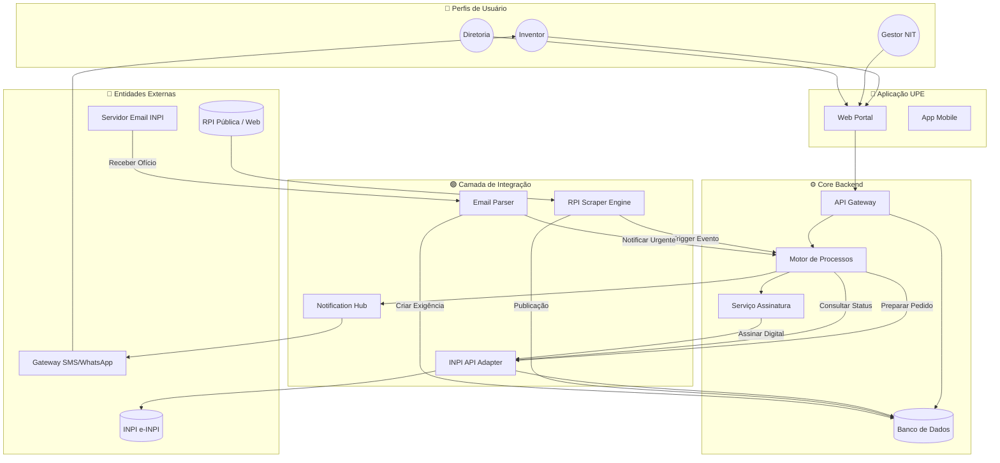
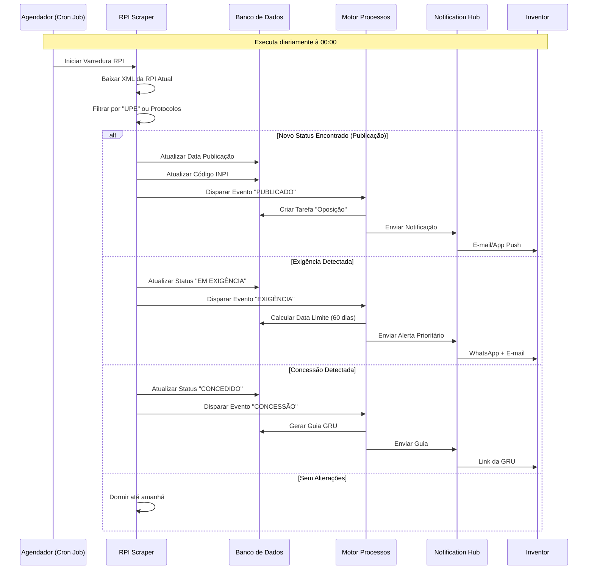

# ARQUITETURA DE AUTOMAÇÃO E INTEGRAÇÃO
## Engenharia de Software - Sistema de Patentes UPE

**Versão:** 1.0  
**Data:** 28/12/2025  
**Responsável:** Engenharia de Contexto - Crush

---

## 1. VISÃO GERAL

Este documento define a arquitetura técnica para automação dos fluxos de trabalho entre a UPE e o INPI (Instituto Nacional da Propriedade Industrial), visando minimizar a entrada manual de dados (Input) e maximizar a garantia de recebimento de dados (Output) através de integrações orientadas a eventos.

---

## 2. ESTRATÉGIA DE AUTOMAÇÃO

### 2.1. Camada de Integração (Middleware)

Para comunicação bidirecional (UPE <-> INPI), o sistema utilizará uma **Camada de Adaptação de Serviços**.

**Componentes Principais:**

1.  **INPI API Gateway (Formal):**
    *   **Função:** Integração via REST API do sistema e-INPI.
    *   **Uso:** Upload de formulários XML/JSON, envio de petições.
    *   **Protocolo:** HTTPS + OAuth2 (ou certificado ICP-Brasil se aplicável).

2.  **RPI Scraper Engine (Monitoramento):**
    *   **Função:** Motor de scraping diário da Revista da Propriedade Industrial (RPI).
    *   **Uso:** Capturar publicações, deferimentos, indeferimentos e exigências.
    *   **Protocolo:** HTTP GET + Parse XML.

3.  **Email/Webhook Parser (Inbound):**
    *   **Função:** Consumidor de notificações enviadas pelo INPI.
    *   **Uso:** Transformar texto não estruturado (e-mail de exigência) em dados estruturados no banco UPE.
    *   **Protocolo:** IMAP/POP3 (E-mail) ou Webhook.

4.  **Notification Hub (Outbound):**
    *   **Função:** Central de envio multicanal.
    *   **Uso:** Notificar usuários (Inventores, NIT, Diretoria) sobre prazos e eventos.
    *   **Protocolo:** SMTP (E-mail), WhatsApp API, Firebase Push.

---

## 3. MAPA DE AUTOMAÇÃO

| Etapa do Processo | Status Atual (Manual) | Solução de Automação Proposta | Ganho de Eficiência |
|-------------------|-----------------------|--------------------------------|---------------------|
| **Depósito** | Upload manual de PDF no portal. | **Robô de Preparação:** Gera XML padrão INPI, valida assinaturas digitais e envia via API. | **Alta** |
| **Protocolização** | Monitoramento manual para pegar o número. | **Webhook Listener:** Captura evento de "Pedido Protocolado" ou verifica a cada 15 min via API. | **Média** |
| **Publicação (RPI)** | Leitura manual da RPI quinzenal. | **RPI Monitor:** Scraper automático que detecta a publicação e extrai o Código INPI. | **Crítica** (Reduz 100%) |
| **Exigência (Ofício)** | E-mail do INPI encaminhado manualmente. | **Parser Inteligente:** Detecta e-mail de exigência, extrai data limite, cria Ticket de Exigência. | **Crítica** |
| **Concessão** | Baixa do RPI e pagamento manual. | **Auto-Trigger:** Ao detectar "Concessão" no RPI, gera a GRU com dados pré-preenchidos. | **Alta** |
| **Anuidade** | Planilha de controle. | **Annuity Engine:** Calcula datas de vencimento baseadas no depósito e alerta com antecedência. | **Alta** |

---

## 4. DIAGRAMA DE ARQUITETURA DE COMPONENTES

---

## 5. LOOP DE MONITORAMENTO AUTOMÁTICO (Cron Job)

---

## 6. ESPECIFICAÇÃO TÉCNICA

### 6.1. Scraper da RPI (Guarantia de Dados)
*   **Fonte:** `rpi.xml` (Público INPI).
*   **Frequência:** Diário (Cron: `0 0 * * *`).
*   **Lógica:**
    1.  Baixar XML.
    2.  Parsear tags `<publication-code>`, `<despacho>`, `<numero-pedido>`.
    3.  Atualizar tabelas `pedidos` e `historico_publicacoes`.

### 6.2. Gerenciamento de Exigências
*   **Gatilho:** Parser de E-mail detecta palavra-chave "Exigência" + Número Protocolo.
*   **Lógica:**
    1.  Extrair data limite da exigência (Regra: RPI Data + 60 dias).
    2.  Criar objeto `Deadline` no Banco.
    3.  Agendar alertas recursivos (T-30, T-7, T-1).

### 6.3. Integração de Pagamentos (GRU)
*   **Gatilho:** Evento "Concessão" detectado.
*   **Lógica:**
    1.  Gerar link de pagamento GRU (API da Receita Federal ou Web Scraper do INPI).
    2.  Salvar link em `pedidos.gru_url`.
    3.  Notificar responsável financeiro.

---

## 7. STACK TECNOLÓGICA RECOMENDADA

| Camada | Tecnologia | Justificativa |
|--------|-----------|---------------|
| **Backend** | Java (Spring Boot) | Robustez para BPMN e integrações complexas. |
| **Agendador** | Quartz Scheduler / Bull | Gestão confiável de Cron Jobs. |
| **Parser XML** | JAXB / fast-xml-parser | Eficiência na leitura da RPI. |
| **Web Scraper** | Puppeteer / Playwright | Fallback se API do INPI falhar. |
| **Webhook** | Amazon API Gateway / NGINX | Recebimento de chamadas do INPI. |
| **Notificação** | Twilio (WhatsApp) / SendGrid | Alta entregabilidade. |
| **Banco** | PostgreSQL | Integridade relacional necessária para patentes. |
