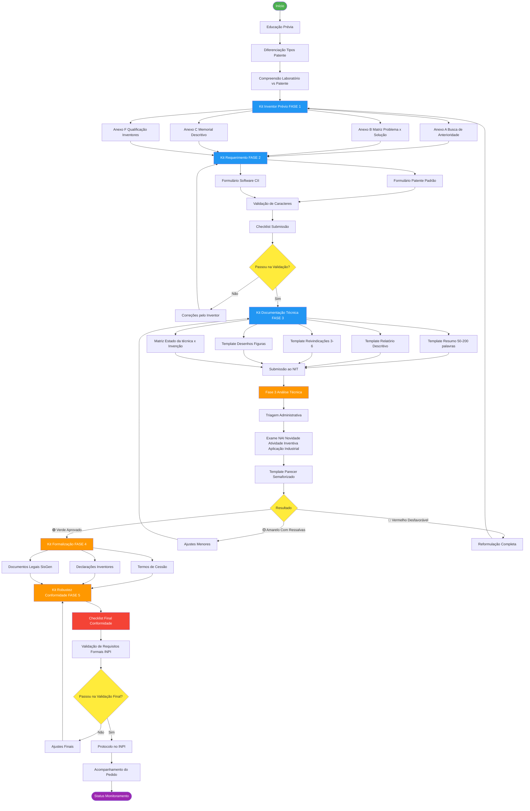
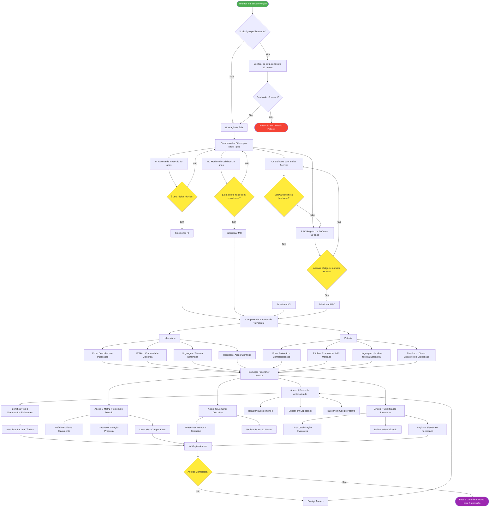
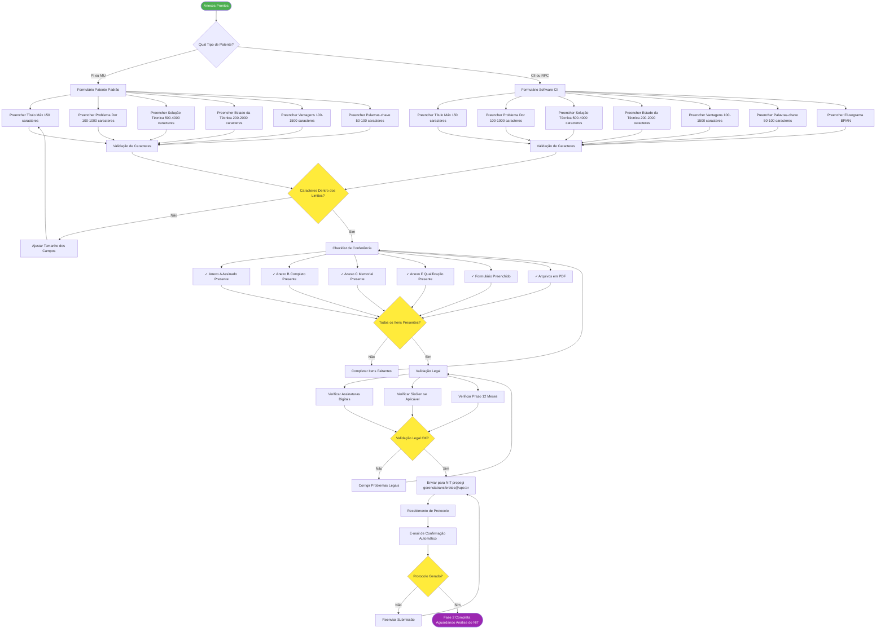
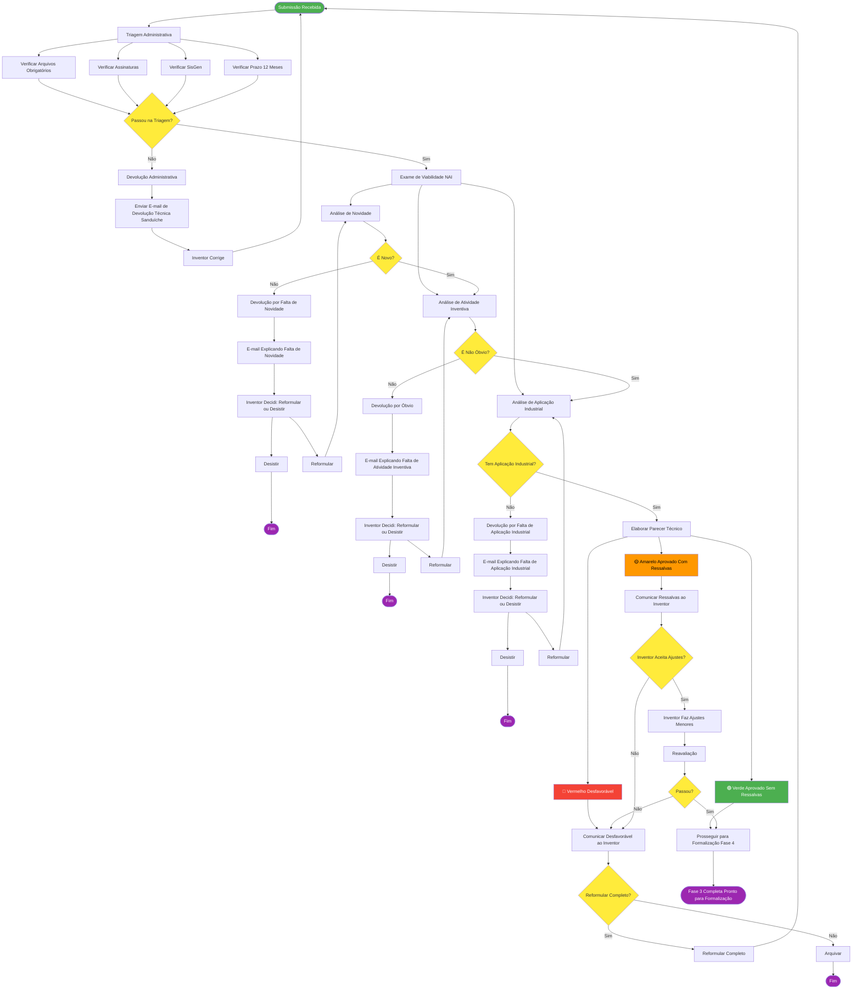
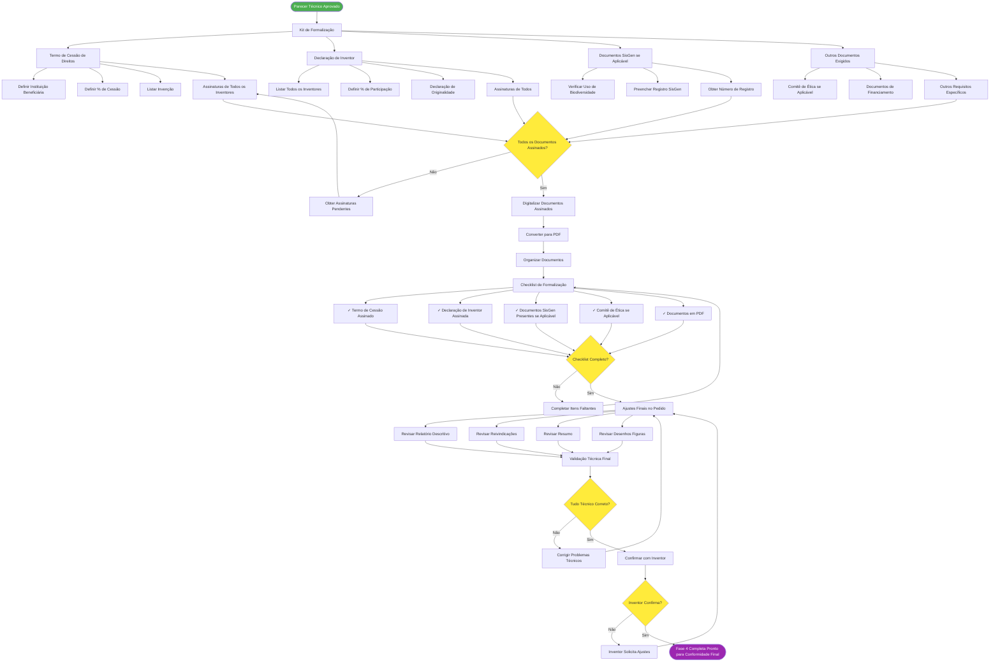
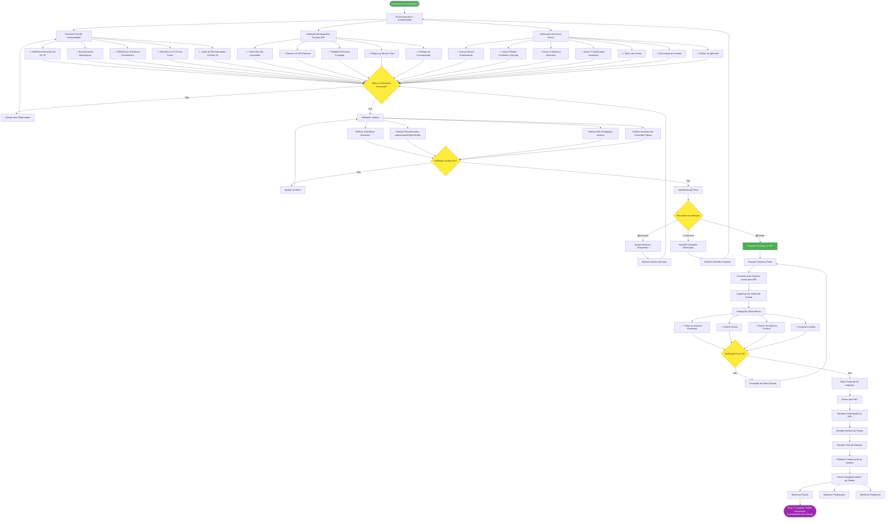

# COMPREENSÃO DO PROJETO E DIAGRAMAS DE FLUXO
## Sistema de Gestão de Propriedade Intelectual UPE - Projeto Crush

---

## 1. O QUE EU DEPREENDO DO PROJETO

### 1.1 Resumo Executivo

Este é um projeto de **transformação digital do processo de patenteamento** da Universidade de Pernambuco (UPE), com objetivo de criar um sistema integral de gestão de propriedade intelectual que resolva problemas crônicos e posicione a instituição como referência nacional.

### 1.2 O Problema Atual (Dor)

**Cenário Atual:**
- **Alto índice de falhas** no registro de patentes
- Inventores sem orientação adequada para escrever na linguagem técnica do INPI
- **Sobrecarga** dos avaliadores do NIT (Núcleo de Inovação Tecnológica)
- **Demora excessiva** na protocolização
- **Retrabalho constante** (inventores e avaliadores)
- **Taxa de indeferimento** elevada

**Causa Raiz:**
- Falta de estrutura documental clara
- Ausência de templates validados
- Inventores desconhecem a diferença entre tipos de patente (PI, MU, CII, RPC)
- Processos sem padronização
- Filtros de qualidade inexistentes na entrada
- Falta de formação conceitual prévia

### 1.3 A Solução Proposta

**Abordagem:** Sistema Integral de Alta Performance com Engenharia de Contexto

**Pilares da Solução:**

1. **Educação Preventiva (Fase 1)**
   - Antes de escrever, o inventor entende conceitos
   - Diferenciação clara entre tipos de patente
   - Compreensão de "Laboratório vs. Patente"

2. **Coleta Estruturada (Fase 2)**
   - Formulários digitais validados
   - Campos essenciais pré-definidos
   - Validação automática de caracteres
   - Separado por tipo de patente

3. **Documentação Técnica Padronizada (Fase 3)**
   - Templates validados para cada componente do pedido
   - Guias passo-a-passo
   - Exemplos "Certo/Errado"
   - Limites de caracteres/palavras explícitos

4. **Formalização Jurídica (Fase 4)**
   - Modelos de termos de cessão
   - Declarações de inventores
   - Checklists de documentos legais

5. **Blindagem Contra Indeferimento (Fase 5)**
   - Checklists finais de conformidade
   - Verificações extras
   - Validação de requisitos formais do INPI

### 1.4 Metodologia Aplicada

**Engenharia de Contexto:**
- Compreensão profunda do ecossistema de inovação acadêmica
- Análise de 21 documentos existentes
- Identificação de padrões e lacunas

**Alta Performance (McKinsey/Lean):**
- Eliminação de desperdícios (retrabalho)
- Foco em KPIs mensuráveis
- Melhoria contínua (PDCA)

**UX/UI Design:**
- Poka-Yoke (prevenção de erros) em cada etapa
- Semaforização visual (RAG)
- Exemplos contrastantes (Certo/Errado)
- Interface amigável e intuitiva

**Framework CRUSHER (Engenharia de Prompt):**
- **C**ontext → Compreensão do cenário
- **R**ole → Definição de papéis
- **U**ser Task → Tarefas específicas
- **S**tyle → Estilo consistente
- **H**igh-Level Objectives → KPIs alinhados
- **E**xamples → Exemplos práticos
- **R**equirements → Requisitos explícitos

### 1.5 KPIs e Objetivos

| KPI | Meta | Impacto |
|-----|------|---------|
| **Redução de Retrabalho** | > 90% | Inventores e avaliadores poupam tempo |
| **Satisfação UX** | > 90% | Inventores felizes com o processo |
| **Tempo Primeira Devolutiva** | ≤ 10 dias úteis | Agilidade no processo |
| **Taxa Aprovação Entrada** | > 70% | Menos devoluções |
| **Tempo Redução Redação** | 50% | Inventores escrevem mais rápido |
| **Taxa Deferimento INPI** | +20% | Mais patentes aprovadas |

### 1.6 Estrutura do Sistema

**5 Fases Principais:**
1. **Preparação** (Responsabilidade: Inventor/Pesquisador)
2. **Submissão** (Portão de Entrada: Filtro de Qualidade)
3. **Análise** (Responsabilidade: NIT/Comissão)
4. **Depósito** (Finalização no INPI)
5. **Robustez e Conformidade** (Garantia de Qualidade)

**21 Documentos Analizados → 49 Documentos Sistematizados**

---

## 2. DIAGRAMAS DE FLUXO SEQUENCIAL

### 2.1 Visão Macro: Fluxo Completo do Processo

### 2.2 Detalhamento: Fase 1 - Preparação (Responsabilidade: Inventor)

### 2.3 Detalhamento: Fase 2 - Submissão (Portão de Entrada)

### 2.4 Detalhamento: Fase 3 - Análise Técnica (Responsabilidade: NIT)

### 2.5 Detalhamento: Fase 4 - Formalização (Responsabilidade: NIT + Inventor)

### 2.6 Detalhamento: Fase 5 - Robustez e Conformidade (Blindagem Final)

---

## 3. RESUMO DOS FLUXOS

### 3.1 Pontos de Decisão Críticos (Gates)

| Gate | Localização | Critério | Ação se Reprovado |
|------|-------------|----------|-------------------|
| **Gate 1** | Fase 1 → Fase 2 | Anexos completos e corretos | Retornar à Fase 1 |
| **Gate 2** | Submissão (Fase 2) | Validação de caracteres e legal | Devolução para correções |
| **Gate 3** | Análise Técnica (Fase 3) | NAI (Novidade, Atividade Inventiva, Aplicação Industrial) | Devolução ou arquivamento |
| **Gate 4** | Formalização (Fase 4) | Todos os documentos assinados | Obter assinaturas pendentes |
| **Gate 5** | Robustez (Fase 5) | Conformidade completa com INPI | Ajustes finais ou revisão completa |

### 3.2 Responsabilidades por Fase

| Fase | Responsabilidade Principal | Atividade |
|------|----------------------------|-----------|
| **1. Preparação** | Inventor/Pesquisador | Educação, preenchimento de anexos |
| **2. Submissão** | Portão de Entrada | Validação, filtros de qualidade |
| **3. Análise** | NIT/Comissão de Avaliação | Exame NAI, parecer técnico |
| **4. Formalização** | NIT + Inventor | Documentos legais, ajustes finais |
| **5. Robustez** | Garantia de Qualidade | Validação final, protocolo INPI |

### 3.3 Documentos por Fase

| Fase | Documentos | Total |
|------|------------|-------|
| **1. Preparação** | Guias educativos, Anexos A/B/C/F, Templates | 11 |
| **2. Submissão** | Formulários, Checklists, E-mails automáticos | 6 |
| **3. Análise** | Templates de parecer, Guias de avaliação | 10 |
| **4. Formalização** | Manual de operações, Memorandos, Termos | 10 |
| **5. Robustez** | Checklist final, Validação jurídica, Proteção múltipla | 12 |
| **TOTAL** | | 49 documentos |

---

## 4. MÉTRICAS E INDICADORES

### 4.1 Métricas de Tempo

| Etapa | Tempo Alvo | Tempo Atual | Melhoria |
|-------|------------|-------------|----------|
| **Educação Prévia** | 2-4 horas | 1-2 semanas | 85% |
| **Preenchimento de Anexos** | 1-2 dias | 2-4 semanas | 75% |
| **Submissão** | 1 dia | 1-2 semanas | 92% |
| **Primeira Devolutiva** | ≤ 10 dias úteis | 2-4 semanas | 60% |
| **Formalização** | 2-3 dias | 2-3 semanas | 85% |
| **Depósito** | 1-2 dias | 1-2 semanas | 92% |

### 4.2 Métricas de Qualidade

| Indicador | Meta | Baseline | Melhoria |
|-----------|------|----------|----------|
| **Redução de Retrabalho** | > 90% | 0% | 90%+ |
| **Satisfação UX** | > 90% | Desconhecido | Medir |
| **Taxa Aprovação Entrada** | > 70% | ~30% | +133% |
| **Taxa Deferimento INPI** | +20% | Baseline | Medir |
| **Conformidade Formais** | 100% | ~60% | +67% |

---

## 5. CONCLUSÃO

### O Que Eu Depreendo do Projeto:

1. **É um projeto de transformação digital** do processo de patenteamento da UPE
2. **Usa Engenharia de Contexto** para compreender profundamente o ecossistema
3. **Aborda o problema de forma preventiva** (educação antes da escrita)
4. **Implementa filtros de qualidade** em cada gate de decisão
5. **Padroniza tudo** (templates, checklists, exemplos)
6. **Foca em UX** (experiência do inventor intuitiva e amigável)
7. **Mensura tudo** (KPIs claros e alcançáveis)
8. **É escalável** (pode ser replicado em outras instituições)

### Visão de Futuro:

O sistema posicionará o NIT/UPE como **referência nacional** em gestão de propriedade intelectual, com:
- Menos retrabalho para inventores e avaliadores
- Maior qualidade dos pedidos depositados
- Maior taxa de deferimento no INPI
- Mais valor comercial dos ativos tecnológicos
- Maior satisfação dos inventores

---

**Versão:** 1.0
**Data:** 28 de dezembro de 2025
**Autoria:** Sistema Crush - Engenharia de Contexto
**Status:** ✅ DOCUMENTAÇÃO COMPLETA
