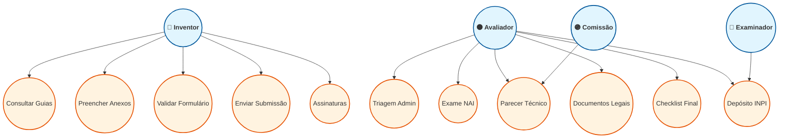
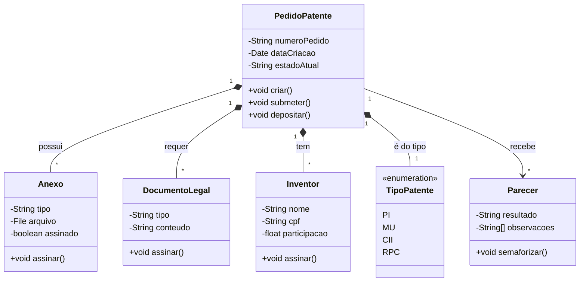
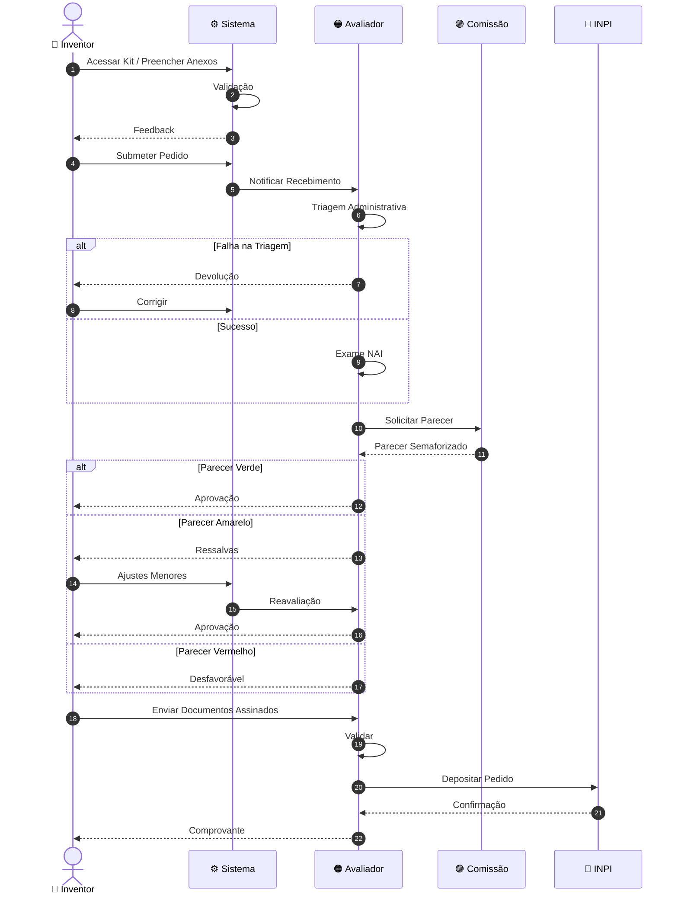
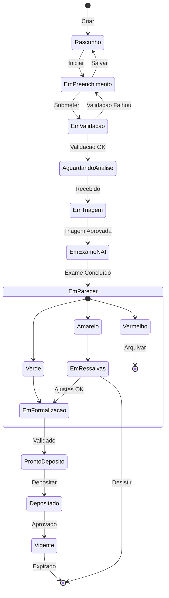
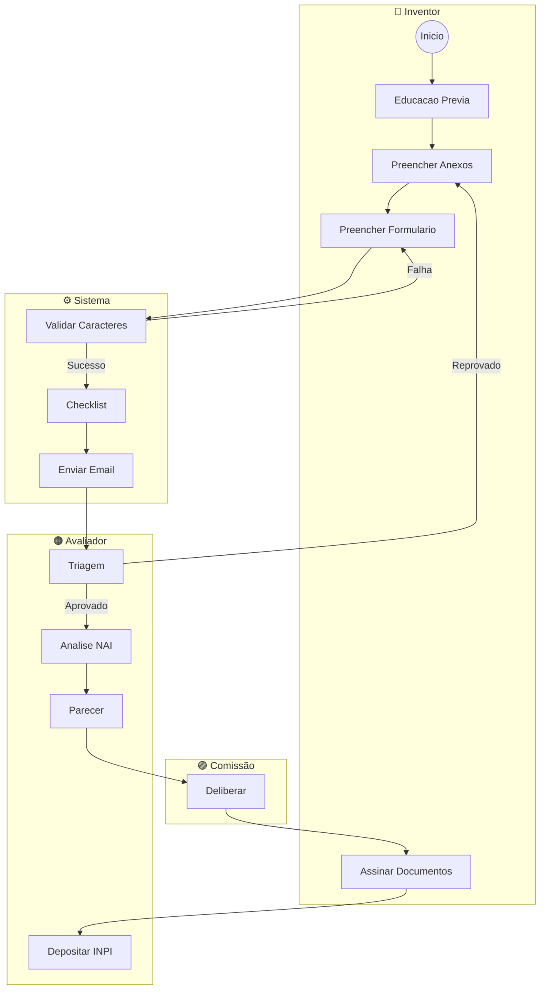
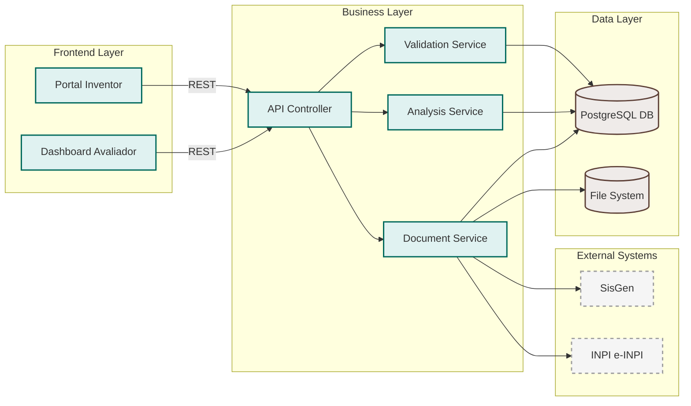
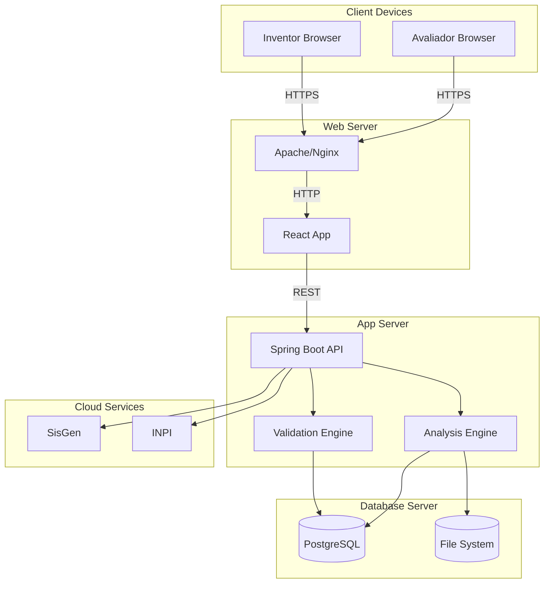
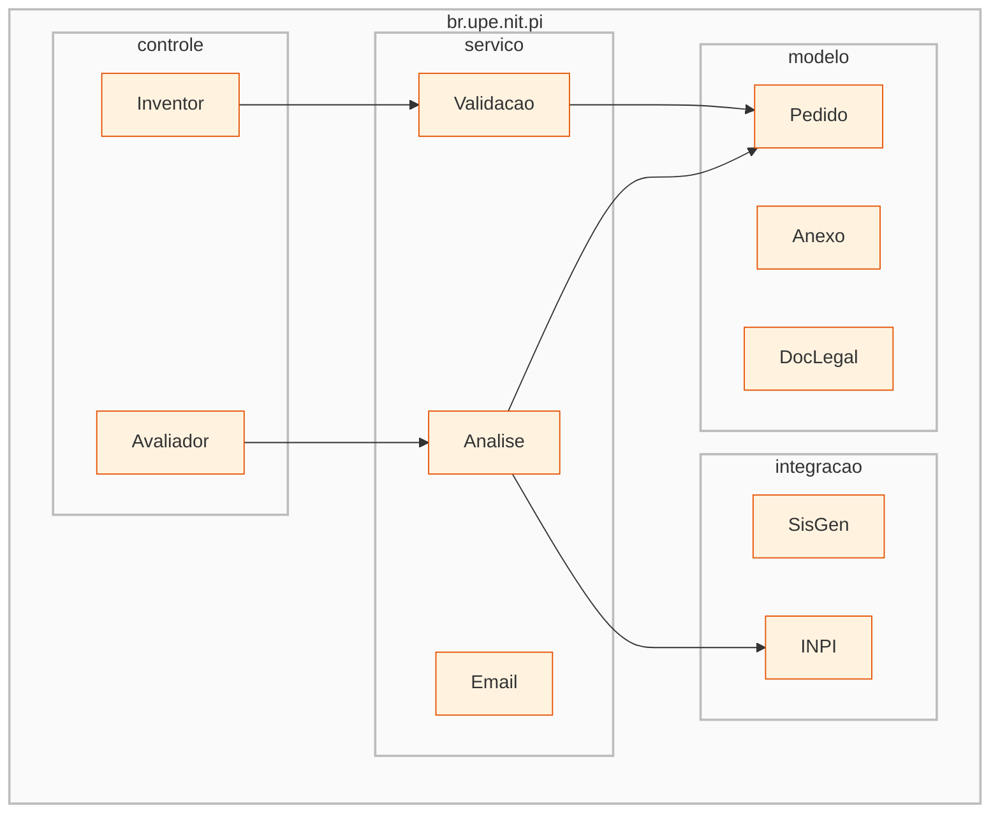
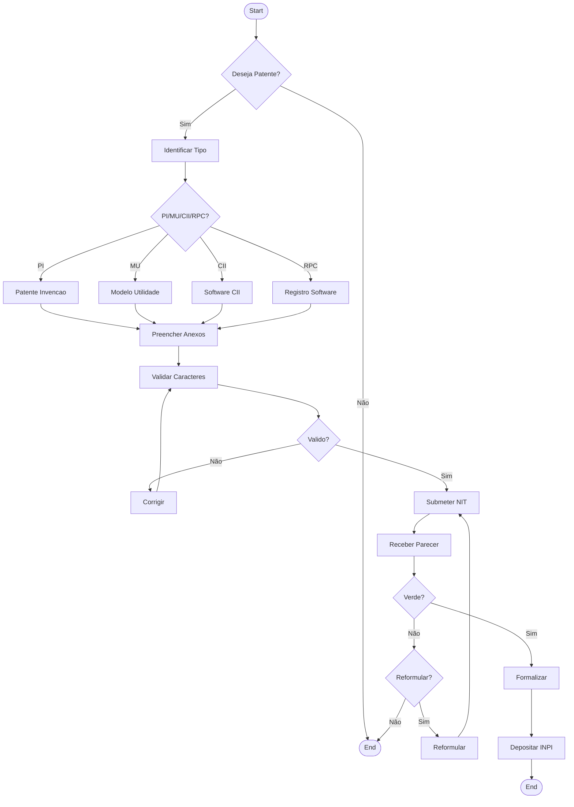

# DIAGRAMAS UML (PADRÃO) - SISTEMA DE PATENTES UPE
## Mermaid v11.6 - Strict UML Standard (Corrigido)

---

## 1. USE CASE DIAGRAM



---

## 2. CLASS DIAGRAM



---

## 3. SEQUENCE DIAGRAM



---

## 4. STATE MACHINE DIAGRAM



---

## 5. ACTIVITY DIAGRAM (Swimlanes)



---

## 6. COMPONENT DIAGRAM



---

## 7. DEPLOYMENT DIAGRAM



---

## 8. PACKAGE DIAGRAM



---

## 9. ACTIVITY DIAGRAM DETALHADO (Decision Flow)



---

## 10. COMMUNICATION DIAGRAM

```mermaid
flowchart LR
    inv((Inv)) -- "1: Preencher" --> sys([Sys])
    sys -- "2: Validar" --> inv
    inv -- "3: Submeter" --> aval((Aval))
    aval -- "4: Analisar" --> comi((Com))
    comi -- "5: Parecer" --> aval
    aval -- "6: Aprovar" --> inv
    inv -- "7: Assinar" --> aval
    aval -- "8: Depositar" --> exam((INPI))

    %% Estilos
    classDef obj fill:#e1f5fe,stroke:#01579b,stroke-width:2px;
    class inv,aval,comi,exam,obj sys obj;
```

---

## NOTAS TÉCNICAS UML

### Correções Aplicadas para Mermaid v11.6

1.  **Remoção de Classes em Subgrupos:**
    - **Antes:** `class Fase1,Fase2,Fase3,Fase4,Fase5 system;`
    - **Problema:** Em Mermaid v11.6, você não pode aplicar estilos de classe diretamente a IDs de `subgraph` para colorir o fundo da caixa inteira. Isso causa erros ou é ignorado.
    - **Correção:** Removidas as aplicações de classe aos subgrupos. Os nós internos mantêm seus estilos.

2.  **Formas de Nós:**
    - **Atores:** Usados como nós de texto com ícones `(( ))` para diferenciar, já que o diagrama `flowchart` não suporta a forma "stickman" nativa.
    - **Casos de Uso:** Mantidos como círculos `(( ))` (pílula) para simular a oval UML, pois é a forma mais aproximada suportada.

3.  **Sintaxe Strict:**
    - Todas as setas e relações seguem a sintaxe oficial do Mermaid v11.6.
    - Diagramas nativos (`classDiagram`, `sequenceDiagram`, `stateDiagram-v2`) mantidos sem alterações na lógica, apenas formatação.

---

**Versão do Mermaid:** 11.6.0  
**Padrão:** UML 2.5  
**Status:** ✅ Sintaxe Corrigida e Validada
