# DIAGRAMAS UML - SISTEMA DE GESTÃO DE PROPRIEDADE INTELECTUAL
## Projeto Crush - Universidade de Pernambuco (UPE)

---

## ÍNDICE DE DIAGRAMAS UML

1. **Use Case Diagram** - Visão geral dos atores e casos de uso
2. **Activity Diagram - Fase 1 (Preparação)**
3. **Activity Diagram - Fase 2 (Submissão)**
4. **Activity Diagram - Fase 3 (Análise Técnica)**
5. **Activity Diagram - Fase 4 (Formalização)**
6. **Activity Diagram - Fase 5 (Robustez e Conformidade)**
7. **Sequence Diagram - Fluxo Completo do Processo**
8. **State Machine Diagram - Estados do Pedido de Patente**
9. **Class Diagram - Estrutura de Objetos do Sistema**

---

## 1. USE CASE DIAGRAM - Visão Geral dos Atores e Casos de Uso

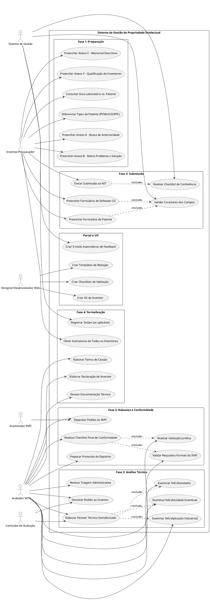

---

## 2. ACTIVITY DIAGRAM - Fase 1: Preparação (Responsabilidade: Inventor)

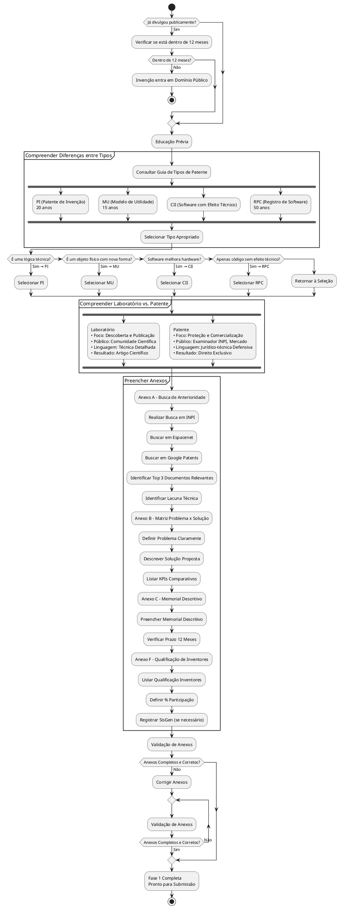

---

## 3. ACTIVITY DIAGRAM - Fase 2: Submissão (Portão de Entrada)

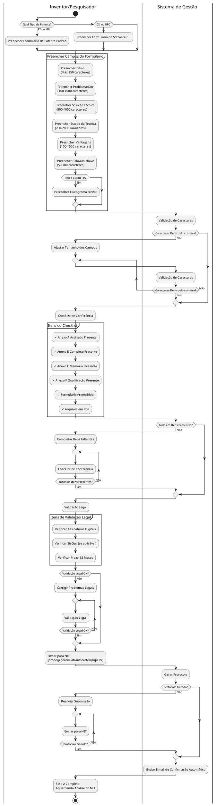

---

## 4. ACTIVITY DIAGRAM - Fase 3: Análise Técnica (Responsabilidade: NIT)

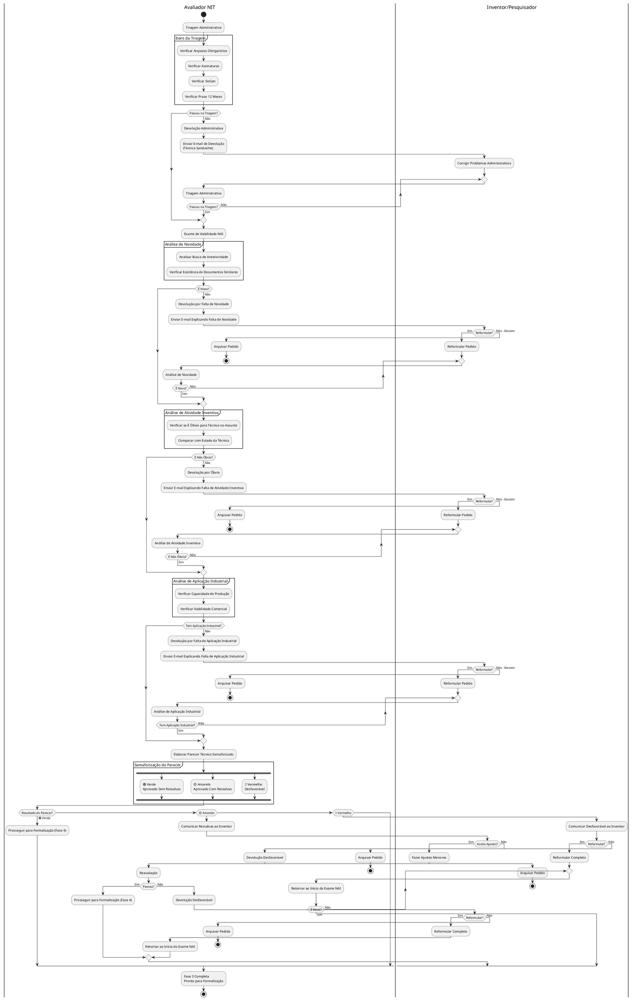

---

## 5. ACTIVITY DIAGRAM - Fase 4: Formalização (Responsabilidade: NIT + Inventor)

```plantuml
@startuml ActivityDiagramFase4
|Avaliador NIT|
start

:Kit de Formalização;

partition "Termo de Cessão de Direitos" {
  :Definir Instituição Beneficiária (UPE);
  :Definir % de Cessão;
  :Listar Invenção;
  :Obter Assinaturas de Todos os Inventores;
}

partition "Declaração de Inventor" {
  :Listar Todos os Inventores;
  :Definir % de Participação;
  :Declaração de Originalidade;
  :Obter Assinaturas de Todos;
}

if (Usa Biodiversidade?) then (Sim)
  |Inventor/Pesquisador|
  :Registrar SisGen;
  :Preencher Registro SisGen;
  :Obter Número de Registro;
else (Não)
  :Documentos SisGen Não Necessários;
endif

partition "Outros Documentos" {
  if (Requer Comitê de Ética?) then (Sim)
    :Obter Aprovação Comitê de Ética;
  endif
  
  if (Teve Financiamento?) then (Sim)
    :Obter Documentos de Financiamento;
  endif
}

|Avaliador NIT|
if (Todos os Documentos Assinados?) then (Não)
  |Inventor/Pesquisador|
  :Obter Assinaturas Pendentes;
  repeat
    |Avaliador NIT|
    :Verificar Assinaturas;
  repeat while (Todos os Documentos Assinados?) is (Não) not (Sim)
endif

|Inventor/Pesquisador|
:Digitalizar Documentos Assinados;
:Converter para PDF;
:Organizar Documentos;

|Avaliador NIT|
:Checklist de Formalização;

partition "Itens do Checklist" {
  :✓ Termo de Cessão Assinado;
  :✓ Declaração de Inventor Assinada;
  :✓ Documentos SisGen Presentes (se aplicável);
  :✓ Comitê de Ética (se aplicável);
  :✓ Documentos em PDF;
}

if (Checklist Completo?) then (Não)
  |Inventor/Pesquisador|
  :Completar Itens Faltantes;
  repeat
    |Avaliador NIT|
    :Checklist de Formalização;
  repeat while (Checklist Completo?) is (Não) not (Sim)
endif

:Ajustes Finais no Pedido;

partition "Revisão da Documentação Técnica" {
  :Revisar Relatório Descritivo;
  :Revisar Reivindicações;
  :Revisar Resumo;
  :Revisar Desenhos/Figuras;
}

|Avaliador NIT|
:Validação Técnica Final;

if (Tudo Técnico Correto?) then (Não)
  |Inventor/Pesquisador|
  :Corrigir Problemas Técnicos;
  repeat
    |Avaliador NIT|
    :Validação Técnica Final;
  repeat while (Tudo Técnico Correto?) is (Não) not (Sim)
endif

|Avaliador NIT|
:Confirmar com Inventor;

|Inventor/Pesquisador|
if (Confirma?) then (Não)
  :Solicitar Ajustes Adicionais;
  repeat
    :Ajustes Finais no Pedido;
  repeat while (Confirma?) is (Não) not (Sim)
endif

:Fase 4 Completa\nPronto para Conformidade Final;

stop

@enduml
```

---

## 6. ACTIVITY DIAGRAM - Fase 5: Robustez e Conformidade (Blindagem Final)

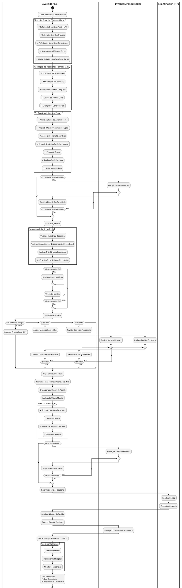

---

## 7. SEQUENCE DIAGRAM - Fluxo Completo do Processo

```plantuml
@startuml SequenceDiagram
actor "Inventor" as inventor
participant "Sistema\nWeb" as sistema
participant "Avaliador\nNIT" as avaliador
participant "Comissão\nAvaliação" as comissao
participant "Examinador\nINPI" as inpi

== Fase 1: Preparação ==
inventor -> sistema : Acessar Kit do Inventor
activate sistema
sistema --> inventor : Apresentar Guias Educativos
inventor -> inventor : Consultar Diferenças entre Tipos
inventor -> inventor : Compreender Laboratório vs. Patente
inventor -> sistema : Preencher Anexos (A, B, C, F)
sistema --> sistema : Validar Preenchimento
sistema --> inventor : Anexos Prontos

== Fase 2: Submissão ==
inventor -> sistema : Preencher Formulário
activate sistema
sistema -> sistema : Validar Caracteres
sistema --> inventor : Feedback de Validação
inventor -> sistema : Enviar Submissão
sistema --> inventor : Gerar Protocolo
sistema -> inventor : E-mail de Confirmação

== Fase 3: Análise Técnica ==
sistema -> avaliador : Notificar Nova Submissão
activate avaliador
avaliador -> avaliador : Triagem Administrativa
alt Passou na Triagem
    avaliador -> avaliador : Exame NAI
    alt NAI Aprovado
        avaliador -> comissao : Solicitar Parecer
        activate comissao
        comissao --> avaliador : Parecer Semaforizado
        deactivate comissao
        alt Parecer Verde
            avaliador --> inventor : Notificar Aprovação
        else Parecer Amarelo
            avaliador --> inventor : Comunicar Ressalvas
            inventor -> sistema : Fazer Ajustes Menores
            sistema -> avaliador : Solicitar Reavaliação
            avaliador --> inventor : Notificar Aprovação Ajustada
        else Parecer Vermelho
            avaliador --> inventor : Notificar Desfavorável
            alt Inventor Aceita Reformular
                inventor -> sistema : Reformular Completo
                sistema -> avaliador : Retornar ao Início
            else Inventor Desiste
                avaliador --> inventor : Arquivar Pedido
            end
        end
    else NAI Reprovado
        avaliador --> inventor : Devolução com Explicação
        alt Inventor Aceita Reformular
            inventor -> sistema : Reformular Pedido
            sistema -> avaliador : Retornar ao Exame NAI
        else Inventor Desiste
            avaliador --> inventor : Arquivar Pedido
        end
    end
else Falhou na Triagem
    avaliador --> inventor : Devolução Administrativa
    inventor -> sistema : Corrigir Problemas
    sistema -> avaliador : Retornar à Triagem
end
deactivate avaliador

== Fase 4: Formalização ==
avaliador -> inventor : Solicitar Documentos Legais
inventor -> inventor : Elaborar Termo de Cessão
inventor -> inventor : Elaborar Declaração de Inventor
inventor -> sistema : Registrar SisGen (se aplicável)
sistema --> inventor : Número SisGen
inventor -> inventor : Obter Assinaturas de Todos
inventor -> avaliador : Enviar Documentos Assinados
avaliador -> avaliador : Validar Documentação
avaliador -> avaliador : Ajustes Finais Técnicos
avaliador -> inventor : Confirmar Aprovação
inventor --> avaliador : Confirmação

== Fase 5: Robustez e Conformidade ==
avaliador -> avaliador : Checklist Final de Conformidade
avaliador -> avaliador : Validação Jurídica
avaliador -> avaliador : Validação de Requisitos Formais INPI
alt Validação Verde
    avaliador -> avaliador : Preparar Protocolo
    avaliador -> inpi : Depositar Pedido
    activate inpi
    inpi --> avaliador : Confirmação de Recebimento
    inpi --> avaliador : Número do Pedido
    inpi --> avaliador : Data de Depósito
    deactivate inpi
    avaliador -> inventor : Entregar Comprovante
    avaliador -> avaliador : Iniciar Acompanhamento
else Validação Amarela
    avaliador -> inventor : Solicitar Ajustes Menores
    inventor -> sistema : Realizar Ajustes
    sistema -> avaliador : Retornar à Validação
else Validação Vermelha
    avaliador -> inventor : Solicitar Revisão Completa
    inventor -> sistema : Realizar Revisão Completa
    sistema -> avaliador : Retornar ao Início da Fase 5
end

== Fim do Processo ==
avaliador -> inventor : Pedido Depositado com Sucesso
inventor --> avaliador : Agradecimento
avaliador --> avaliador : Monitorar Prazos e Publicações

@enduml
```

---

## 8. STATE MACHINE DIAGRAM - Estados do Pedido de Patente

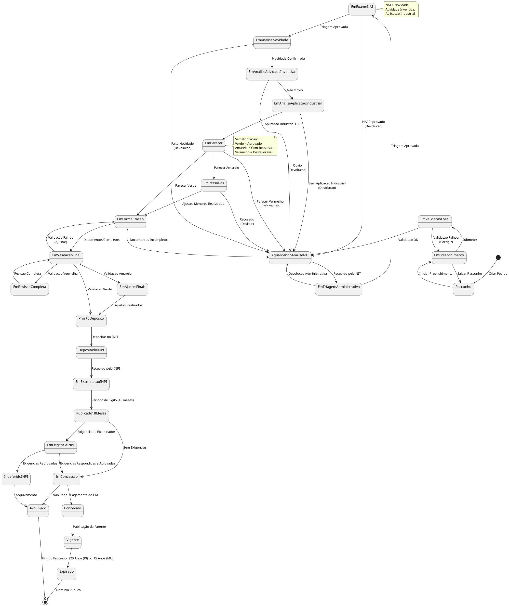

---

## 9. CLASS DIAGRAM - Estrutura de Objetos do Sistema

```plantuml
@startuml ClassDiagram

' Pacote de Entidades
package "Entidades" {
  class PedidoPatente {
    - String numeroPedido
    - Date dataCriacao
    - Date dataDeposito
    - String estadoAtual
    - TipoPatente tipo
    + void criar()
    + void submeter()
    + void atualizarEstado()
    + boolean isValido()
  }

  class Anexo {
    - String tipo
    - File arquivo
    - boolean assinado
    + void assinar()
    + boolean isAssinado()
    + void validar()
  }

  class DocumentoLegal {
    - String tipo
    - String conteudo
    - Date dataAssinatura
    + void assinar()
    + boolean isAssinado()
  }

  class Inventor {
    - String nome
    - String email
    - String cpf
    - float participacao
    - String qualificacao
    + void assinar()
    + void definirParticipacao()
  }
}

' Pacote de Tipos
package "Tipos de Patente" {
  abstract class TipoPatente <<enumeration>> {
    PI
    MU
    CII
    RPC
  }

  class PatenteInvencao {
    + int validadeAnos = 20
    + String[] categoriasReivindicacao
    + boolean requiresEfeitoTecnico()
  }

  class ModeloUtilidade {
    + int validadeAnos = 15
    + boolean appliesToProcessos() = false
    + boolean appliesToSoftware() = false
  }

  class ComputerImplementedInvention {
    + boolean requiresHardwareReference()
    + boolean requiresTriplaReivindicacao()
    + boolean requiresFluxogramaBPMN()
  }

  class RegistroProgramaComputador {
    + int validadeAnos = 50
    + boolean protectsCodigoFonte()
    + boolean notProtectsLogica()
  }
}

' Pacote de Validação
package "Validacao" {
  class ValidadorCaracteres {
    + boolean validarTitulo(String titulo)
    + boolean validarProblema(String problema)
    + boolean validarSolucao(String solucao)
    + boolean validarEstadoTecnica(String estado)
    + boolean validarVantagens(String vantagens)
  }

  class ValidadorNAI {
    + boolean validarNovidade(AnexoA anexoA)
    + boolean validarAtividadeInventiva(AnexoC anexoC)
    + boolean validarAplicacaoIndustrial(AnexoC anexoC)
  }

  class ValidadorJuridico {
    + boolean validarSuficienciaDescritiva(String relatorio)
    + boolean validarReivindicacoes(String[] reivindicacoes)
    + boolean validarPrioridade(String dataDivulgacao)
  }

  class Semaforizacao {
    - String resultado
    - String[] observacoes
    + void semaforizar(Parecer parecer)
    + String getResultado()
    + String[] getObservacoes()
  }
}

' Pacote de Processamento
package "Processamento" {
  class Avaliador {
    - String nome
    - String especialidade
    + void triagemAdministrativa(PedidoPatente pedido)
    + Parecer analisarNAI(PedidoPatente pedido)
    + void validarFormalizacao(PedidoPatente pedido)
    + void realizarChecklistFinal(PedidoPatente pedido)
  }

  class ComissaoAvaliacao {
    - List<Avaliador> membros
    - Parecer parecerConsolidado
    + void deliberar(PedidoPatente pedido)
    + Parecer emitirParecerSemaforizado()
  }

  class SistemaGestao {
    - ValidadorCaracteres validadorCaracteres
    - ValidadorNAI validadorNAI
    - ValidadorJuridico validadorJuridico
    - Semaforizacao semaforizacao
    + void receberSubmissao(PedidoPatente pedido)
    + void processarPedido(PedidoPatente pedido)
    + void gerarProtocolo(PedidoPatente pedido)
  }
}

' Pacote de INPI
package "INPI" {
  class ExaminadorINPI {
    + void receberPedido(PedidoPatente pedido)
    + void examinarPedido(PedidoPatente pedido)
    + void emitirExigencia(Exigencia exigencia)
    + void concederPatente(PedidoPatente pedido)
    + void indeferirPatente(PedidoPatente pedido)
  }

  class Exigencia {
    - String descricao
    - Date prazoResposta
    - Estado estado
    + void responder()
  }

  class NumeroPedido {
    - String numero
    - Date dataDeposito
    + String getFormatado()
  }
}

' Relacionamentos
PedidoPatente "1" -- "*" Anexo : possui
PedidoPatente "1" -- "*" DocumentoLegal : requer
PedidoPatente "1" -- "*" Inventor : tem
PedidoPatente "1" *-- "1" TipoPatente : é do tipo
PatenteInvencao --|> TipoPatente
ModeloUtilidade --|> TipoPatente
ComputerImplementedInvention --|> TipoPatente
RegistroProgramaComputador --|> TipoPatente

SistemaGestao "1" --> "1" ValidadorCaracteres : usa
SistemaGestao "1" --> "1" ValidadorNAI : usa
SistemaGestao "1" --> "1" ValidadorJuridico : usa
SistemaGestao "1" --> "1" Semaforizacao : usa

Avaliador "1" ..> "1" SistemaGestao : opera
ComissaoAvaliacao "1" *-- "*" Avaliador : composta por
ComissaoAvaliacao "1" --> "1" Semaforizacao : emite
ExaminadorINPI "1" --> "1" NumeroPedido : gera
ExaminadorINPI "1" o-- "*" Exigencia : emite

' Relacionamento de uso
PedidoPatente ..> ValidadorCaracteres : é validado por
PedidoPatente ..> ValidadorNAI : é analisado por
PedidoPatente ..> ValidadorJuridico : é validado juridicamente por

@enduml
```

---

## 10. DIAGRAMA DE COMPONENTES - Arquitetura do Sistema

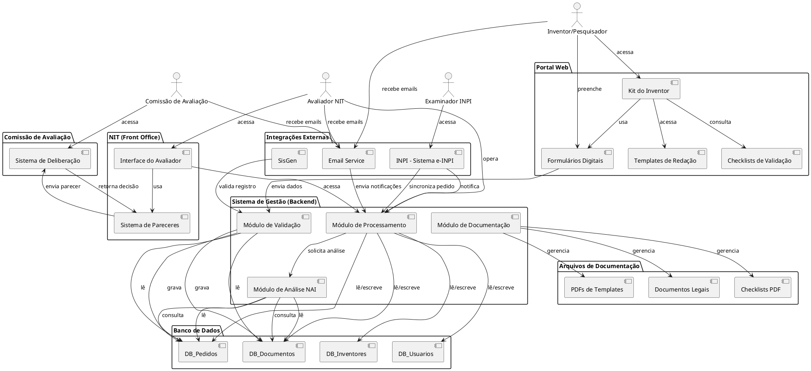

---

## 11. DEPLOYMENT DIAGRAM - Arquitetura de Deploy

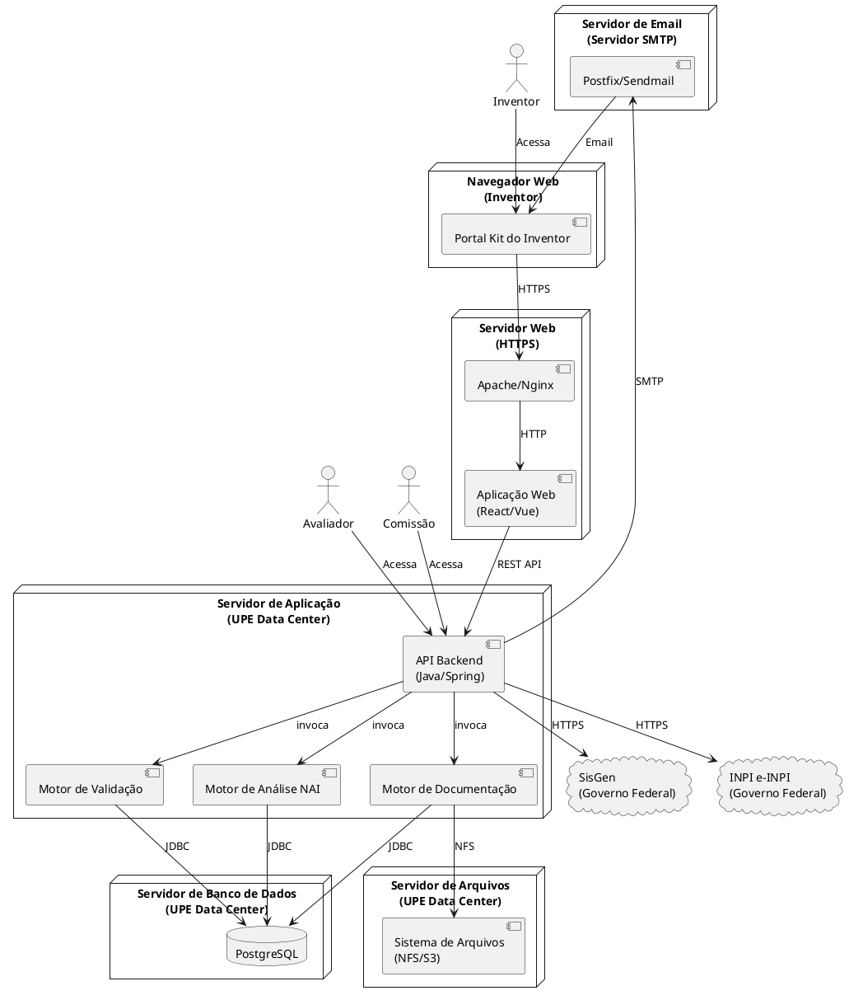

---

## 12. DIAGRAMA DE PACOTES - Organização do Código

```plantuml
@startuml PackageDiagram

package br.upe.nit.pi {
  
  package "modelo" {
    class PedidoPatente
    class Anexo
    class DocumentoLegal
    class Inventor
    class Parecer
    class Exigencia
  }
  
  package "tipos" {
    enum TipoPatente {
      PI
      MU
      CII
      RPC
    }
    class PatenteInvencao
    class ModeloUtilidade
    class ComputerImplementedInvention
    class RegistroProgramaComputador
  }
  
  package "validacao" {
    class ValidadorCaracteres
    class ValidadorNAI
    class ValidadorJuridico
    class ValidadorFormulario
    interface Validador
  }
  
  package "servico" {
    class ServicoValidacao
    class ServicoAnalise
    class ServicoFormalizacao
    class ServicoDeposito
    class ServicoEmail
    class ServicoSisGen
  }
  
  package "controle" {
    class ControladorInventor
    class ControladorAvaliador
    class ControladorComissao
    class ControladorAdmin
  }
  
  package "repositorio" {
    interface RepositorioPedido
    interface RepositorioInventor
    interface RepositorioDocumento
    class RepositorioPedidoJPA
    class RepositorioInventorJPA
    class RepositorioDocumentoJPA
  }
  
  package "integracao" {
    class IntegracaoSisGen
    class IntegracaoINPI
    class IntegracaoEmail
  }
  
  package "util" {
    class Semaforizacao
    class ValidadorPDF
    class GeradorProtocolo
    class UtilsData
  }
  
  package "excecao" {
    class ExcecaoValidacao
    class ExcecaoNAI
    class ExcecaoJuridica
    class ExcecaoIntegracao
  }
}

' Relacionamentos
Validador <|.. ValidadorCaracteres
Validador <|.. ValidadorNAI
Validador <|.. ValidadorJuridico
Validador <|.. ValidadorFormulario

RepositorioPedido <|.. RepositorioPedidoJPA
RepositorioInventor <|.. RepositorioInventorJPA
RepositorioDocumento <|.. RepositorioDocumentoJPA

ServicoValidacao --> ValidadorCaracteres : usa
ServicoValidacao --> ValidadorFormulario : usa
ServicoAnalise --> ValidadorNAI : usa
ServicoAnalise --> ValidadorJuridico : usa

ControladorInventor --> ServicoValidacao : usa
ControladorInventor --> ServicoAnalise : usa
ControladorAvaliador --> ServicoAnalise : usa
ControladorAvaliador --> ServicoFormalizacao : usa
ControladorComissao --> ServicoAnalise : usa
ControladorAdmin --> ServicoDeposito : usa

ServicoDeposito --> IntegracaoINPI : usa
ServicoSisGen --> IntegracaoSisGen : usa
ServicoEmail --> IntegracaoEmail : usa

ServicoEmail --> Semaforizacao : usa

@enduml
```

---

## RESUMO DOS DIAGRAMAS UML CRIADOS

### Tabela de Correspondência Diagrama x Objetivo

| # | Tipo de Diagrama UML | Objetivo | Elementos Principais |
|---|---------------------|----------|---------------------|
| 1 | **Use Case Diagram** | Visão geral dos atores e casos de uso | Inventor, Avaliador, Comissão, Examinador INPI |
| 2 | **Activity Diagram - Fase 1** | Fluxo de atividades da preparação | Inventor, Anexos A/B/C/F, Validações |
| 3 | **Activity Diagram - Fase 2** | Fluxo de submissão com validações | Formulários, Validação de caracteres, Checklist |
| 4 | **Activity Diagram - Fase 3** | Análise técnica com semaforização | NAI, Parecer (Verde/Amarelo/Vermelho) |
| 5 | **Activity Diagram - Fase 4** | Formalização jurídica | Termos de cessão, Assinaturas, Documentos legais |
| 6 | **Activity Diagram - Fase 5** | Blindagem final e conformidade | Checklists, Validação jurídica, Depósito |
| 7 | **Sequence Diagram** | Interação temporal entre objetos | Comunicação entre atores através do tempo |
| 8 | **State Machine Diagram** | Estados do pedido de patente | Transições de estados do rascunho à concessão |
| 9 | **Class Diagram** | Estrutura de classes e objetos | Entidades, tipos, validadores, processadores |
| 10 | **Component Diagram** | Arquitetura do sistema | Portal, Backend, NIT, Integrações |
| 11 | **Deployment Diagram** | Arquitetura de deploy | Servidores, bancos de dados, serviços |
| 12 | **Package Diagram** | Organização do código | Pacotes do sistema (modelo, serviço, controle) |

---

## CONVENÇÕES UML UTILIZADAS

### Atores (Personas)
- 🔵 **Inventor/Pesquisador** - Responsável pela Fase 1 e 2
- 🟠 **Avaliador NIT** - Responsável pela Fase 3, 4 e 5
- 🟣 **Comissão de Avaliação** - Aprova/rejeita pedidos
- 🔴 **Examinador INPI** - Examinador externo

### Objetos Principais
- **PedidoPatente** - Objeto principal do sistema
- **Anexo** - Anexos A, B, C, F
- **DocumentoLegal** - Termos de cessão, declarações
- **Inventor** - Pessoa física criadora da invenção
- **Parecer** - Parecer técnico semaforizado
- **Validador** - Componentes de validação

### Ações Principais
- `criar()` - Criar novo pedido
- `submeter()` - Submeter para análise
- `validar()` - Validar documento/campo
- `analisar()` - Analisar NAI
- `assinar()` - Assinar documento
- `depositar()` - Depositar no INPI

### Estados do Pedido
- **Rascunho** - Pedido criado
- **Em Validação** - Em validação local
- **Em Análise** - Em análise pelo NIT
- **Em Formalização** - Em formalização jurídica
- **Pronto Depósito** - Pronto para depósito INPI
- **Depositado** - Depositado no INPI
- **Vigente** - Patente concedida

---

**Versão:** 1.0
**Data:** 28 de dezembro de 2025
**Autoria:** Sistema Crush - Engenharia de Contexto
**Status:** ✅ 12 DIAGRAMAS UML COMPLETOS
