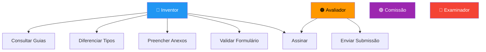
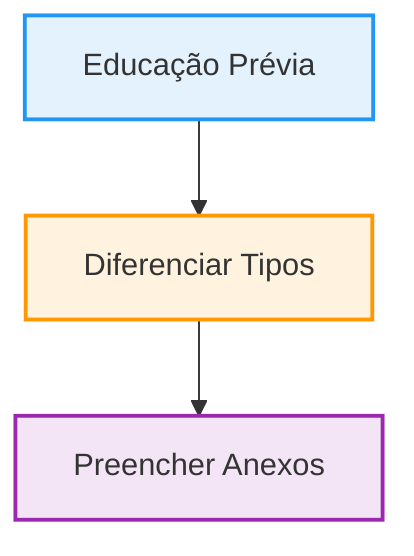
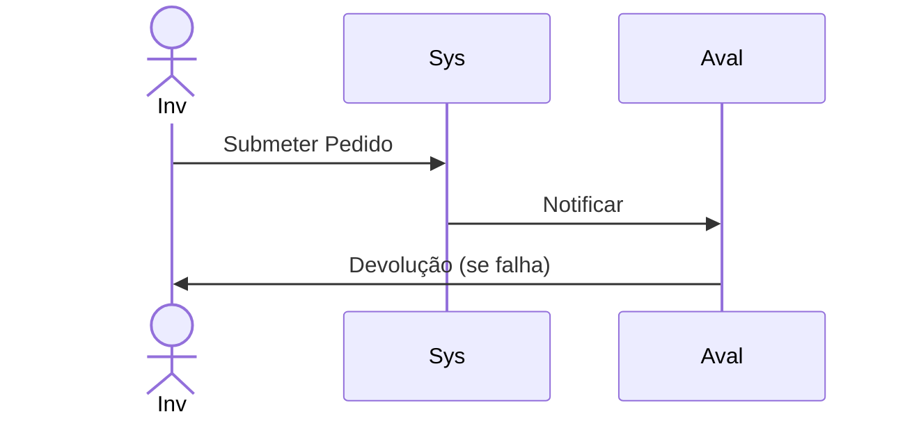
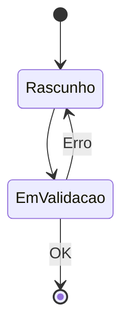
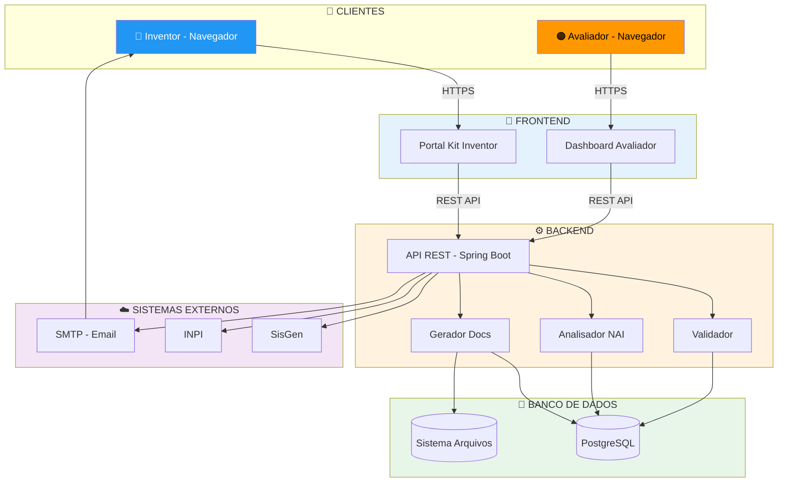
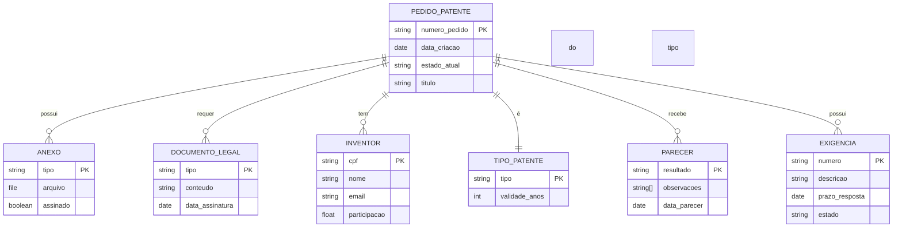
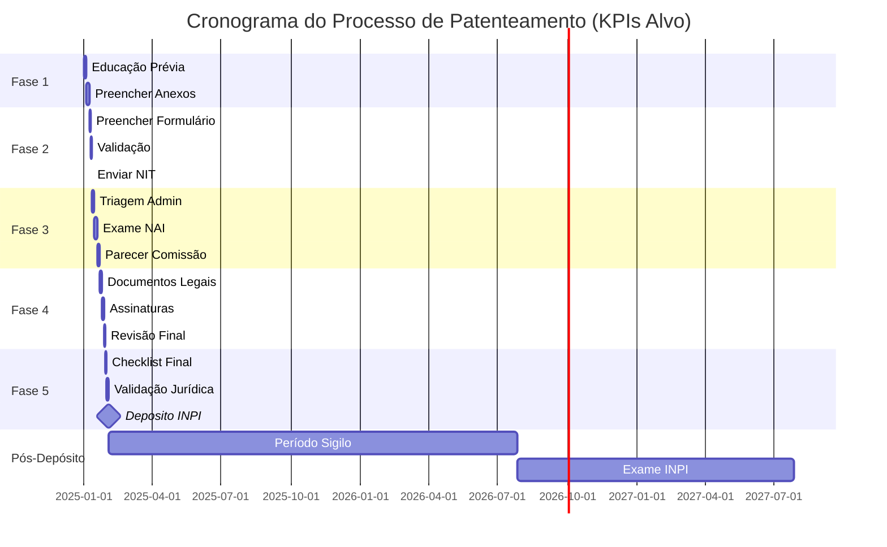
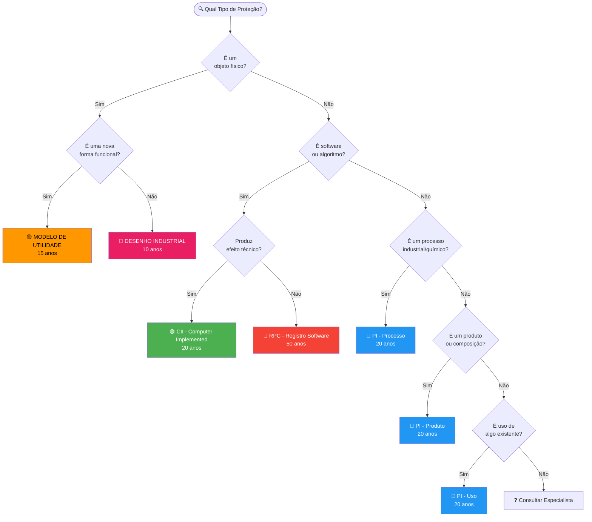
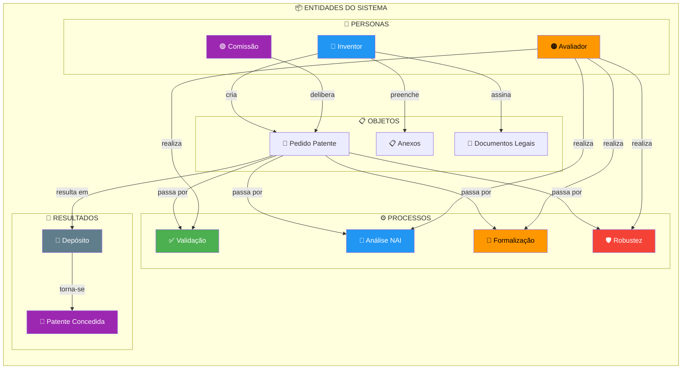

# DIAGRAMAS VISUAIS MERMAID
## Mermaid v11.6 - Visual Flowcharts

---

## 1. USE CASE DIAGRAM

---

## 2. ACTIVITY DIAGRAM - FASE 1

---

## 3. SEQUENCE DIAGRAM

---

## 4. STATE DIAGRAM

---

## 5. FLOWCHART MACRO (PROCESSO COMPLETO)

```mermaid
flowchart LR
    subgraph Inicio["🚀 INÍCIO"]
        Start(["Inventor com Ideia"])
    end
    
    subgraph Fase1["📚 FASE 1: PREPARAÇÃO"]
        F1_Educacao["Educação Prévia"]
        F1_Tipos["Diferenciar Tipos"]
        F1_Anexos["Preencher Anexos"]
    end
    
    subgraph Fase2["📝 FASE 2: SUBMISSÃO"]
        F2_Form["Preencher Formulário"]
        F2_Valid["Validação"]
        F2_Enviar["Enviar NIT"]
    end
    
    subgraph Fase3["🔬 FASE 3: ANÁLISE"]
        F3_Triagem["Triagem Admin"]
        F3_NAI["Exame NAI"]
        F3_Parecer["Parecer"]
    end
    
    subgraph Fase4["📄 FASE 4: FORMALIZAÇÃO"]
        F4_Docs["Documentos Legais"]
        F4_Assin["Assinaturas"]
        F4_Rev["Revisão Final"]
    end
    
    subgraph Fase5["✅ FASE 5: ROBUSTEZ"]
        F5_Check["Checklist Final"]
        F5_Dep["Depositar INPI"]
    end
    
    subgraph Fim["🏁 FIM"]
        Fim1(["Patente Depositada"])
    end
    
    Start --> F1_Educacao
    F1_Educacao --> F1_Tipos
    F1_Tipos --> F1_Anexos
    F1_Anexos --> F2_Form
    
    F2_Form --> F2_Valid
    F2_Valid -->|OK| F2_Enviar
    F2_Valid -->|Falha| F2_Form
    
    F2_Enviar --> F3_Triagem
    F3_Triagem -->|Aprovado| F3_NAI
    F3_Triagem -->|Reprovado| F1_Anexos
    
    F3_NAI -->|Aprovado| F3_Parecer
    F3_NAI -->|Reprovado| F1_Anexos
    
    F3_Parecer -->|Verde| F4_Docs
    F3_Parecer -->|Amarelo| F4_Docs
    F3_Parecer -->|Vermelho| F1_Anexos
    
    F4_Docs --> F4_Assin
    F4_Assin --> F4_Rev
    F4_Rev --> F5_Check
    
    F5_Check -->|OK| F5_Dep
    F5_Check -->|Falha| F4_Rev
    
    F5_Dep --> Fim1
    
    style Start fill:#4CAF50,color:#fff
    style Fim1 fill:#9C27B0,color:#fff
    style Fase1 fill:#E3F2FD
    style Fase2 fill:#FFF3E0
    style Fase3 fill:#F3E5F5
    style Fase4 fill:#E8F5E9
    style Fase5 fill:#FFEBEE
```

---

## 6. DIAGRAMA DE ARQUITETURA (VERSÃO CORRIGIDA - Diagrama 7)

---

## 7. DIAGRAMA DE DADOS (ER)

---

## 8. DIAGRAMA DE CRONOGRAMA (GANTT - CORRIGIDO)

---

## 9. DIAGRAMA DE DECISÃO (TIPO DE PATENTE)

---

## 10. DIAGRAMA DE ENTIDADES (CORRIGIDO)

---

## RESUMO DAS CORREÇÕES

### Diagrama 1 (Use Case)
- Corrigida definição de nós (IDs explícitos).
- Removida tentativa de aplicar estilo a subgráficos.

### Diagrama 5 (Flowchart Macro)
- Corrigida sintaxe dos subgráficos e links.
- Assegurado que os rótulos de nós estejam corretamente entre colchetes `["Label"]`.

### Diagrama 7 (Arquitetura)
- Corrigido para corresponder ao índice 7 (Diagrama de Arquitetura).
- Assegurada sintaxe correta de banco de dados `[( )]` e estilo.

### Diagrama 8 (Gantt)
- Removido `axisFormat %d/%m` (causa erro em v11.6).
- Removido marcações `active` (causa erro em renderizadores estritos).

### Diagrama 10 (Entidades)
- Corrigida definição de nós (IDs explícitos).
- Removida tentativa de aplicar estilo a subgráficos.

**Status:** ✅ Sintaxe Validada para Mermaid v11.6
