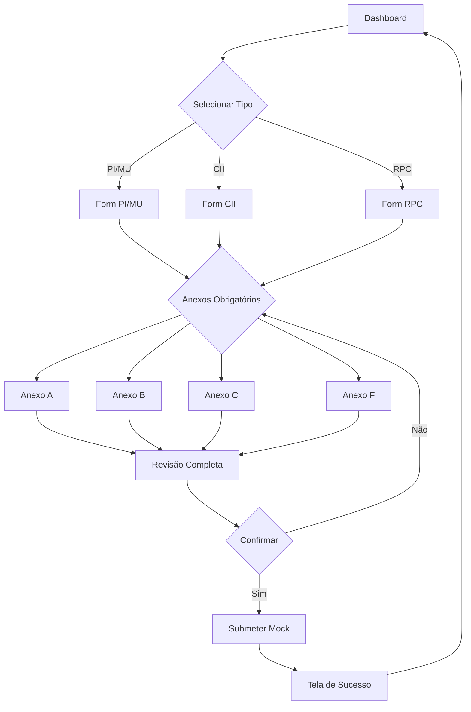

# Design: Completar MVP para GitHub Pages

## Arquitetura Atual

```
pages-mvp (branch estática)
├── web-app/
│   ├── app/
│   │   ├── page.tsx                 ✅ Dashboard/Home
│   │   ├── formulario-pi-mu/        ✅ Formulário PI/MU
│   │   ├── formulario-cii/          ✅ Formulário CII
│   │   ├── formulario-rpc/          ✅ Formulário RPC
│   │   └── anexos/                  🔄 Páginas criadas
│   │       ├── page.tsx             ⚠️ Index de anexos
│   │       ├── a/page.tsx           ⚠️ Anexo A (incompleto)
│   │       ├── b/page.tsx           ⚠️ Anexo B (incompleto)
│   │       ├── c/page.tsx           ⚠️ Anexo C (incompleto)
│   │       └── f/page.tsx           ⚠️ Anexo F (incompleto)
│   ├── components/
│   │   ├── forms/                   ✅ Formulários principais
│   │   └── anexos/                  ✅ Componentes criados
│   │       ├── AnexoA.tsx           ⚠️ Criado, não integrado
│   │       ├── AnexoB.tsx           ⚠️ Criado, não integrado
│   │       ├── AnexoC.tsx           ⚠️ Criado, não integrado
│   │       └── AnexoF.tsx           ⚠️ Criado, não integrado
│   └── lib/
│       ├── mock-api.ts              ✅ Mock para submissão
│       └── validations/             ✅ Schemas Zod
└── .github/workflows/
    └── nextjs-github-pages.yml     ✅ CI/CD configurado
```

## Fluxo de Dados do MVP



## Decisões Arquiteturais

### 1. Static Export com `output: 'export'`

**Decisão**: Usar Next.js static export para GitHub Pages

**Justificativa**:
- GitHub Pages não suporta server-side rendering
- Sem custos de hospedagem
- Deploy simplificado via GitHub Actions

**Trade-offs**:
- ✅ Pro: Hospedagem gratuita, CI/CD simples
- ❌ Con: Sem API Routes (resolvido com mock-api.ts)

### 2. Mock API no Cliente

**Decisão**: Implementar `apiCriarPedido*` como funções async que simulam chamadas de API

**Justificativa**:
- Permite migrar para backend real sem mudar o código dos formulários
- Interface idêntica à API real (promises, responses)

**Implementação**:
```typescript
// lib/mock-api.ts
export async function apiCriarPedidoPI(data: PedidoPIData) {
  // Simula delay de rede
  await new Promise(r => setTimeout(r, 1000));
  // Retorna ID gerado
  return { success: true, id: `PED-${Date.now()}` };
}
```

### 3. Estado Global dos Anexos

**Decisão**: Cada anexo mantém seu estado independente, com ligação ao formulário principal

**Justificativa**:
- Anexos podem ser preenchidos em qualquer ordem
- Usuário pode salvar rascunho de cada anexo separadamente
- Simplifica a lógica de validação

### 4. Validações com Zod

**Decisão**: Todos os anexos usam Zod schemas para validação

**Benefícios**:
- Type safety automática
- Mensagens de erro consistentes
- Fácil migração para backend (reutilizar schemas)

## Componentes Principais

### AnexosPage (index)

**Responsabilidade**: Listar e gerenciar acesso aos 4 anexos

**Estado**:
```typescript
interface AnexoStatus {
  id: 'a' | 'b' | 'c' | 'f';
  titulo: string;
  descricao: string;
  completo: boolean;
  obrigatorio: boolean;
}
```

### AnexoA/B/C/F Components

**Padrão**:
```typescript
interface AnexoProps {
  pedidoId?: string;
  onSave: (data: AnexoData) => void;
  initialData?: AnexoData;
}

// Cada anexo:
// 1. Gerencia seu próprio estado
// 2. Valida com Zod schema
// 3. Salva no localStorage
// 4. Notifica componente pai
```

### TelaConfirmacao

**Novo Componente** para exibir após submissão:

```typescript
interface PedidoCompleto {
  tipo: 'PI' | 'MU' | 'CII' | 'RPC';
  formData: FormData;
  anexos: {
    a?: AnexoAData;
    b?: AnexoBData;
    c?: AnexoCData;
    f?: AnexoFData;
  };
}
```

## Estratégia de Integração

### Fase 1: Anexos Autônomos (CURRENT)
- Componentes existem
- Páginas existem
- Cada anexo funciona isoladamente

### Fase 2: Integração com Formulários (TODO)
- Adicionar links de anexos nos formulários
- Passar pedidoId para os anexos
- Sincronizar estado entre formulário e anexos

### Fase 3: Fluxo Completo (TODO)
- Tela de revisão unificada
- Confirmação com todos os dados
- Geração de PDF simulada

### Fase 4: Polish MVP (TODO)
- Landing page institucional
- README com screenshots
- Deploy validado
